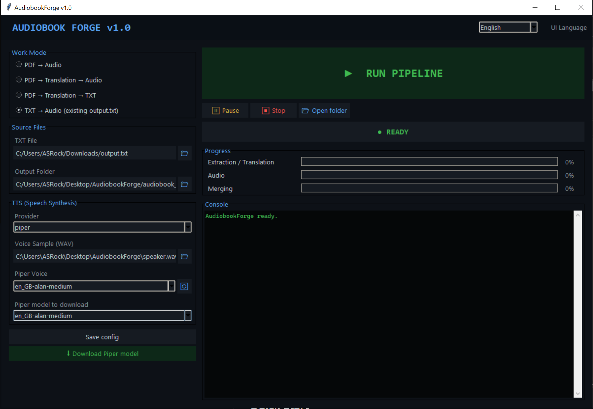

# AudiobookForge


AudiobookForge is a Python `tkinter` desktop application for converting PDFs and text files into audiobooks. It combines direct PDF extraction via `pypdfium2`, fallback LLM Vision OCR for difficult scans, and TTS generation with Piper or Edge TTS, with multilingual UI and built-in Piper model download support.

Open-source desktop tooling for local-first audiobook generation from PDFs and TXT files.

## Project Highlights

- `PDF -> Audio`, `PDF -> Translation -> Audio`, `PDF -> Translation -> TXT`, `TXT -> Audio`
- `pypdfium2` rendering and extraction without Poppler
- `LLM Vision OCR` fallback for scanned or badly encoded PDFs
- `Piper`, `Edge TTS`, `Chatterbox`, `OpenAI TTS`, `ElevenLabs`
- multilingual desktop UI with runtime language switching
- current UI languages: Polish, Czech, Slovak, Slovenian, Croatian, Romanian, Hungarian, English, German, French, Spanish, Italian, Russian, Ukrainian, Turkish, Catalan, Afrikaans, Swahili, Portuguese, Dutch, Swedish, Estonian, Latvian, Lithuanian, Finnish, Danish, Norwegian
- built-in Piper model download workflow
- robust handling of legacy PDFs with broken encoding and OCR fallback

## Quick Start

```bash
pip install -r requirements.txt
python app.py
```

Requirements:
- Python `3.10+`
- `ffmpeg` in `PATH`
- optional `LM Studio` for local OCR/translation workflows

## Choosing A Mode / Provider

- `PDF -> Audio`: best when you want the source language spoken back without translation.
- `PDF -> Translation -> Audio`: use for full OCR/translation plus audiobook output.
- `PDF -> Translation -> TXT`: use when you only want the translated `output.txt` for later editing or reuse.
- `TXT -> Audio`: fastest resume path when `output.txt` already exists and you only need TTS/merge again.
- `Piper`: offline and privacy-friendly, but requires a downloaded `.onnx` voice model.
- `Edge TTS`: easiest voice setup and usually better naturalness, but requires network access.
- `pypdfium2`: first choice for normal text PDFs.
- `LLM Vision OCR`: fallback for scans, image PDFs, or broken encodings; slower and depends on a vision-capable model.

Resume / progress notes:

- each output folder stores `job_state.json`, `tts_state.json`, and `pipeline_stats.json`
- rerunning the same job in the same output folder can resume from saved pages/chunks
- changing TTS voice/provider clears stale audio chunks so resumed audio stays consistent

## Screenshot



## Build / Packaging

Release artifacts:

- `release\AudiobookForgeSetup.exe` - Windows installer for the faster `onedir` build
- `dist\AudiobookForge.exe` - portable single-file build

Build helper scripts:

- `build_release.bat` - builds the portable `onefile` executable
- `build_folder.bat` - builds the faster `onedir` folder version
- `build_installer.bat` - builds the `onedir` version and then compiles the installer with Inno Setup 6

PyInstaller spec files:

- `AudiobookForge.spec` - `onefile` build config
- `AudiobookForge_onedir.spec` - `onedir` build config

Installer config:

- `AudiobookForge.iss` - Inno Setup script used to create `AudiobookForgeSetup.exe`

Portable build:

```bash
build_release.bat
```

Folder build:

```bash
build_folder.bat
```

Installer build:

```bash
build_installer.bat
```

Requirements for installer build:

- Inno Setup 6 installed
- `ISCC.exe` available in `PATH`, or installed in the default Inno Setup folder
- installer languages include English, Polish, Czech, Slovak, Slovenian, Croatian, Romanian, Hungarian, Catalan, Afrikaans, Swahili, Estonian, Latvian, Lithuanian, Finnish, Danish, Norwegian, German, French, Spanish, Italian, Russian, Ukrainian, Turkish, Portuguese, Dutch, and Swedish

Manual PyInstaller example:

```bash
pip install pyinstaller
pyinstaller --onedir --windowed --name AudiobookForge app.py
```

Notes:
- `--onedir` is the preferred mode for this project
- `--onefile` may be problematic with `piper-tts` and `pypdfium2`
- bundle `ffmpeg` separately or ensure it is available in `PATH`
- if you use `icon.ico`, add `--icon=icon.ico`

Repository hygiene:
- generated assets such as `piper_models/`, `audiobook_output/`, `pages/`, `chunks/`, `dist/`, and `build/` are ignored via `.gitignore`
- generated installer output in `release/` is ignored via `.gitignore`
- `config.json` is intentionally ignored to keep machine-local settings out of version control

## Known Limitations

- difficult scanned PDFs still depend on a working Vision-capable LLM endpoint
- OCR quality depends on source quality and selected model quality
- some legacy PDFs may still require OCR fallback even after direct extraction and encoding fixes
- `Edge TTS` requires network access
- `Piper` requires downloaded `.onnx` models and available disk space
- `PyInstaller --onefile` is not recommended for this stack

## Architecture

High-level architecture notes are available here:

- [`docs/architecture.md`](docs/architecture.md)

## Table of Contents

- [Project Highlights](#project-highlights)
- [Quick Start](#quick-start)
- [Screenshot](#screenshot)
- [Build / Packaging](#build--packaging)
- [Known Limitations](#known-limitations)
- [Architecture](#architecture)
- [Polski](#polski)
- [English](#english)
- [Deutsch](#deutsch)
- [Русский](#русский)
- [Українська](#українська)
- [Čeština](#čeština)
- [Français](#français)
- [Español](#español)
- [Italiano](#italiano)
- [Türkçe](#türkçe)
- [Slovencina](#slovencina)
- [Slovenscina](#slovenscina)
- [Hrvatski](#hrvatski)
- [Romana](#romana)
- [Magyar](#magyar)
- [Catala](#catala)
- [Afrikaans](#afrikaans)
- [Kiswahili](#kiswahili)
- [Eesti](#eesti)
- [Latviesu](#latviesu)
- [Lietuviu](#lietuviu)
- [Suomi](#suomi)
- [Dansk](#dansk)
- [Norsk](#norsk)

---

## Polski

### Spis treści

- [Funkcje](#pl-features)
- [Wymagania](#pl-requirements)
- [Instalacja](#pl-installation)
- [Użytkowanie](#pl-usage)
- [Konfiguracja](#pl-configuration)
- [Dostawcy TTS](#pl-tts-providers)
- [Obsługiwane języki](#pl-supported-languages)
- [Contributing](#pl-contributing)
- [Licencja](#pl-license)

<a id="pl-features"></a>
### Features

- Desktopowa aplikacja Python `tkinter` do konwersji `PDF -> audiobook` oraz `TXT -> audiobook`.
- Tryby pracy: `pdf_to_audio`, `translate_to_audio`, `txt_to_audio`.
- Szybka ekstrakcja tekstu przez `pypdfium2`, bez zależności od Popplera.
- Tryb `LLM Vision OCR` dla trudnych, skanowanych lub niestandardowych PDF-ów.
- Automatyczny retry OCR przy pustej odpowiedzi modelu.
- Obsługa starych i źle zakodowanych PDF-ów, w tym korekty problematycznych znaków.
- TTS lokalny przez `Piper` oraz sieciowy przez `Edge TTS`.
- Wielojęzyczny interfejs użytkownika.
- Pobieranie modeli Piper bezpośrednio z GUI.
- Łączenie chunków audio do końcowego pliku `audiobook_final.mp3`.

<a id="pl-requirements"></a>
### Requirements

- Python `3.10+`
- `tkinter` dostępny w instalacji Pythona
- `ffmpeg` dostępny w `PATH`
- `piper-tts`
- `pypdfium2`
- Pakiety z `requirements.txt`
- Opcjonalnie `LM Studio` lub inny zgodny endpoint OpenAI API dla Vision OCR / tłumaczenia

<a id="pl-installation"></a>
### Installation

```bash
python -m venv .venv
.venv\Scripts\activate
pip install -r requirements.txt
pip install pypdfium2 piper-tts
```

Zainstaluj `ffmpeg` i upewnij się, że polecenie `ffmpeg` działa w terminalu.

Uruchomienie:

```bash
python app.py
```

Uwagi buildowe z `PyInstaller`:

- `--onefile` może być problematyczne przy `piper-tts` i `pypdfium2`.
- Preferowany build:

```bash
pyinstaller --onedir --windowed --name AudiobookForge app.py
```

<a id="pl-usage"></a>
### Usage

1. Wybierz tryb pracy.
2. Wskaż plik PDF lub TXT oraz folder wyjściowy.
3. Wybierz metodę ekstrakcji: szybkie `pypdfium2` albo `LLM Vision OCR`.
4. Skonfiguruj dostawcę TTS: `Piper` albo `Edge TTS`.
5. W razie potrzeby pobierz model Piper z poziomu aplikacji.
6. Uruchom pipeline i poczekaj na wygenerowanie chunków oraz finalnego MP3.

`pdf_to_audio`:
Bezpośrednia ekstrakcja tekstu z PDF i synteza audio.

`translate_to_audio`:
OCR / ekstrakcja, tłumaczenie przez model LLM, a następnie synteza audio.

`txt_to_audio`:
Wczytanie gotowego pliku `.txt` i wygenerowanie audiobooka.

<a id="pl-configuration"></a>
### Configuration

Główna konfiguracja jest przechowywana w `config.json`.

Najważniejsze pola:

- `pdf_path`
- `txt_path`
- `output_dir`
- `mode`
- `pdf_language`
- `target_language`
- `extraction_mode`
- `tts_provider`
- `piper_voice`
- `edge_voice`
- `llm_provider`
- `llm_url`
- `llm_model`
- `llm_api_key`

Uwagi techniczne:

- `pypdfium2` jest główną ścieżką ekstrakcji i renderowania stron.
- Dla trudnych stron aplikacja może przełączyć się na OCR obrazowy.
- OCR ma retry przy pustym wyniku.
- Końcowe MP3 jest składane przez `ffmpeg`.

<a id="pl-tts-providers"></a>
### TTS Providers

`Piper`
- Lokalny, offline.
- Wymaga `piper-tts` oraz modelu `.onnx`.
- Najlepszy wybór dla prywatności i pracy offline.

`Edge TTS`
- Głosy neuralne Microsoft Edge.
- Prosta konfiguracja i dobra jakość głosu.
- Wymaga połączenia sieciowego.

<a id="pl-supported-languages"></a>
### Supported Languages

Języki interfejsu:
- Polski
- English
- Deutsch
- Русский
- Українська
- Čeština
- Romana
- Magyar
- Français
- Español
- Italiano
- Türkçe
- Portugues
- Nederlands
- Svenska
- Suomi
- Dansk
- Norsk

Języki docelowe audio / tłumaczenia:
- `pol`
- `eng`
- `deu`
- `rus`
- `ukr`
- `ces`
- `fra`
- `spa`
- `ita`

Języki źródłowe PDF w UI obejmują dodatkowo m.in.:
- `slk`, `por`, `nld`, `hun`, `ron`, `bul`, `slv`, `hrv`, `srp`, `lit`, `lav`, `est`, `fin`, `swe`, `dan`, `nor`, `tur`

<a id="pl-contributing"></a>
### Contributing

Pull requesti i zgłoszenia issue są mile widziane. Warto dołączyć:

- opis scenariusza użycia
- przykładowy PDF lub TXT reprodukujący problem
- log z aplikacji
- informacje o środowisku i konfiguracji TTS / LLM

<a id="pl-license"></a>
### License

Licencja: `MIT`. Szczegóły w pliku `LICENSE`.

---

## English

### Mini TOC

- [Features](#en-features)
- [Requirements](#en-requirements)
- [Installation](#en-installation)
- [Usage](#en-usage)
- [Configuration](#en-configuration)
- [TTS Providers](#en-tts-providers)
- [Supported Languages](#en-supported-languages)
- [Contributing](#en-contributing)
- [License](#en-license)

<a id="en-features"></a>
### Features

- Python `tkinter` desktop app for `PDF -> audiobook` and `TXT -> audiobook`.
- Main modes: `pdf_to_audio`, `translate_to_audio`, `txt_to_audio`.
- Fast direct extraction with `pypdfium2`, without Poppler.
- `LLM Vision OCR` for scanned or difficult PDFs.
- OCR retry logic for empty model responses.
- Better handling of legacy or badly encoded PDFs.
- Local `Piper` TTS and cloud-based `Edge TTS`.
- Multilingual UI.
- Built-in Piper model download workflow.
- Chunk-based audio generation merged into `audiobook_final.mp3`.

<a id="en-requirements"></a>
### Requirements

- Python `3.10+`
- `tkinter`
- `ffmpeg` in `PATH`
- `piper-tts`
- `pypdfium2`
- Dependencies from `requirements.txt`
- Optional `LM Studio` or another OpenAI-compatible endpoint for Vision OCR / translation

<a id="en-installation"></a>
### Installation

```bash
python -m venv .venv
.venv\Scripts\activate
pip install -r requirements.txt
pip install pypdfium2 piper-tts
python app.py
```

PyInstaller notes:

- `--onefile` may be problematic with `piper-tts` and `pypdfium2`.
- Preferred build:

```bash
pyinstaller --onedir --windowed --name AudiobookForge app.py
```

<a id="en-usage"></a>
### Usage

1. Select a mode.
2. Choose the input PDF or TXT file and output folder.
3. Pick extraction mode: `pypdfium2` or `LLM Vision OCR`.
4. Select `Piper` or `Edge TTS`.
5. Download a Piper model if needed.
6. Run the pipeline to generate chunks and the final audiobook.

<a id="en-configuration"></a>
### Configuration

Primary settings are stored in `config.json`.

Key fields:

- `pdf_path`
- `txt_path`
- `output_dir`
- `mode`
- `pdf_language`
- `target_language`
- `extraction_mode`
- `tts_provider`
- `piper_voice`
- `edge_voice`
- `llm_provider`
- `llm_url`
- `llm_model`
- `llm_api_key`

Technical notes:

- `pypdfium2` is the primary extraction and rendering backend.
- Difficult pages can fall back to image-based OCR.
- Empty OCR responses are retried.
- Final MP3 assembly is handled by `ffmpeg`.

<a id="en-tts-providers"></a>
### TTS Providers

`Piper`
- Local and offline
- Requires `piper-tts` and a `.onnx` voice model

`Edge TTS`
- Neural cloud voices
- Easy setup, network required

<a id="en-supported-languages"></a>
### Supported Languages

UI languages:
- Polish
- English
- German
- Russian
- Ukrainian
- Czech
- Romanian
- Hungarian
- French
- Spanish
- Italian
- Turkish
- Portuguese
- Dutch
- Swedish
- Finnish
- Danish
- Norwegian

Audio / translation target languages:
- `pol`, `eng`, `deu`, `rus`, `ukr`, `ces`, `fra`, `spa`, `ita`, `por`, `nld`, `hun`, `ron`, `fin`, `swe`, `dan`, `nor`, `tur`

Additional PDF source language codes are available in the UI.

<a id="en-contributing"></a>
### Contributing

Issues and pull requests are welcome. Include a reproducible sample, logs, environment details, and TTS / LLM configuration when possible.

<a id="en-license"></a>
### License

License: `MIT`. See `LICENSE`.

---

## Deutsch

### Mini TOC

- [Features](#de-features)
- [Requirements](#de-requirements)
- [Installation](#de-installation)
- [Usage](#de-usage)
- [Configuration](#de-configuration)
- [TTS Providers](#de-tts-providers)
- [Supported Languages](#de-supported-languages)
- [Contributing](#de-contributing)
- [License](#de-license)

<a id="de-features"></a>
### Features

- Python-`tkinter`-Desktop-App fur `PDF -> Horbuch` und `TXT -> Horbuch`.
- Hauptmodi: `pdf_to_audio`, `translate_to_audio`, `txt_to_audio`.
- Schnelle Extraktion mit `pypdfium2`, ohne Poppler.
- `LLM Vision OCR` fur schwierige oder gescannte PDFs.
- OCR-Retries bei leeren Modellantworten.
- Bessere Verarbeitung alter oder fehlerhaft kodierter PDFs.
- `Piper` fur lokale Offline-TTS und `Edge TTS` fur Cloud-Stimmen.
- Mehrsprachige Benutzeroberflache.
- Integrierter Download von Piper-Modellen.
- Zusammenfuhrung der Audio-Chunks zu `audiobook_final.mp3`.

<a id="de-requirements"></a>
### Requirements

- Python `3.10+`
- `tkinter`
- `ffmpeg` in `PATH`
- `piper-tts`
- `pypdfium2`
- Abhangigkeiten aus `requirements.txt`
- Optional `LM Studio` oder kompatibler OpenAI-Endpoint

<a id="de-installation"></a>
### Installation

```bash
python -m venv .venv
.venv\Scripts\activate
pip install -r requirements.txt
pip install pypdfium2 piper-tts
python app.py
```

PyInstaller-Hinweis:

```bash
pyinstaller --onedir --windowed --name AudiobookForge app.py
```

`--onefile` kann mit `piper-tts` und `pypdfium2` problematisch sein.

<a id="de-usage"></a>
### Usage

1. Modus auswahlen.
2. PDF- oder TXT-Datei und Ausgabeordner festlegen.
3. Extraktion uber `pypdfium2` oder `LLM Vision OCR` auswahlen.
4. `Piper` oder `Edge TTS` konfigurieren.
5. Optional ein Piper-Modell herunterladen.
6. Pipeline starten.

<a id="de-configuration"></a>
### Configuration

Die Hauptkonfiguration liegt in `config.json`.

Wichtige Felder:
- `pdf_path`
- `txt_path`
- `output_dir`
- `mode`
- `pdf_language`
- `target_language`
- `extraction_mode`
- `tts_provider`
- `piper_voice`
- `edge_voice`
- `llm_provider`
- `llm_url`
- `llm_model`
- `llm_api_key`

<a id="de-tts-providers"></a>
### TTS Providers

`Piper`
- Lokal, offline
- Benotigt `piper-tts` und `.onnx`-Modell

`Edge TTS`
- Neuronale Online-Stimmen
- Netzwerk erforderlich

<a id="de-supported-languages"></a>
### Supported Languages

UI-Sprachen:
- Polski
- English
- Deutsch
- Русский
- Українська
- Čeština
- Romana
- Magyar
- Français
- Español
- Italiano
- Türkçe
- Portugues
- Nederlands
- Svenska
- Suomi
- Dansk
- Norsk

Zielsprachen fur Audio / Ubersetzung:
- `pol`, `eng`, `deu`, `rus`, `ukr`, `ces`, `fra`, `spa`, `ita`, `por`, `nld`, `hun`, `ron`, `fin`, `swe`, `dan`, `nor`, `tur`

<a id="de-contributing"></a>
### Contributing

Fehlermeldungen und Pull Requests sind willkommen. Reproduzierbare Beispiele und Logs helfen bei der Analyse.

<a id="de-license"></a>
### License

Lizenz: `MIT`. Siehe `LICENSE`.

---

## Русский

### Мини TOC

- [Features](#ru-features)
- [Requirements](#ru-requirements)
- [Installation](#ru-installation)
- [Usage](#ru-usage)
- [Configuration](#ru-configuration)
- [TTS Providers](#ru-tts-providers)
- [Supported Languages](#ru-supported-languages)
- [Contributing](#ru-contributing)
- [License](#ru-license)

<a id="ru-features"></a>
### Features

- Настольное приложение на Python `tkinter` для `PDF -> аудиокнига` и `TXT -> аудиокнига`.
- Основные режимы: `pdf_to_audio`, `translate_to_audio`, `txt_to_audio`.
- Быстрое извлечение текста через `pypdfium2` без Poppler.
- `LLM Vision OCR` для сложных и сканированных PDF.
- Повторные попытки OCR при пустом ответе модели.
- Обработка старых и некорректно закодированных PDF.
- Локальный `Piper` и сетевой `Edge TTS`.
- Многоязычный интерфейс.
- Загрузка моделей Piper из GUI.
- Склейка чанков в `audiobook_final.mp3`.

<a id="ru-requirements"></a>
### Requirements

- Python `3.10+`
- `tkinter`
- `ffmpeg`
- `piper-tts`
- `pypdfium2`
- зависимости из `requirements.txt`
- опционально `LM Studio`

<a id="ru-installation"></a>
### Installation

```bash
python -m venv .venv
.venv\Scripts\activate
pip install -r requirements.txt
pip install pypdfium2 piper-tts
python app.py
```

Сборка:

```bash
pyinstaller --onedir --windowed --name AudiobookForge app.py
```

`--onefile` может создавать проблемы с `piper-tts` и `pypdfium2`.

<a id="ru-usage"></a>
### Usage

1. Выберите режим.
2. Укажите PDF или TXT и выходную папку.
3. Выберите `pypdfium2` или `LLM Vision OCR`.
4. Настройте `Piper` или `Edge TTS`.
5. При необходимости загрузите модель Piper.
6. Запустите pipeline.

<a id="ru-configuration"></a>
### Configuration

Основные настройки хранятся в `config.json`.

Ключевые поля:
- `pdf_path`
- `txt_path`
- `output_dir`
- `mode`
- `pdf_language`
- `target_language`
- `extraction_mode`
- `tts_provider`
- `piper_voice`
- `edge_voice`
- `llm_provider`
- `llm_url`
- `llm_model`
- `llm_api_key`

<a id="ru-tts-providers"></a>
### TTS Providers

`Piper`
- локально и офлайн
- требует `piper-tts` и модель `.onnx`

`Edge TTS`
- нейросетевые облачные голоса
- требуется сеть

<a id="ru-supported-languages"></a>
### Supported Languages

Языки интерфейса:
- Polski
- English
- Deutsch
- Русский
- Українська
- Čeština
- Romana
- Magyar
- Français
- Español
- Italiano
- Türkçe
- Portugues
- Nederlands
- Svenska
- Suomi
- Dansk
- Norsk

Языки аудио / перевода:
- `pol`, `eng`, `deu`, `rus`, `ukr`, `ces`, `fra`, `spa`, `ita`, `por`, `nld`, `hun`, `ron`, `fin`, `swe`, `dan`, `nor`, `tur`

<a id="ru-contributing"></a>
### Contributing

Issue и pull request приветствуются. Желательно приложить пример файла, логи и параметры среды.

<a id="ru-license"></a>
### License

Лицензия: `MIT`. См. `LICENSE`.

---

## Українська

### Міні TOC

- [Features](#uk-features)
- [Requirements](#uk-requirements)
- [Installation](#uk-installation)
- [Usage](#uk-usage)
- [Configuration](#uk-configuration)
- [TTS Providers](#uk-tts-providers)
- [Supported Languages](#uk-supported-languages)
- [Contributing](#uk-contributing)
- [License](#uk-license)

<a id="uk-features"></a>
### Features

- Настільний Python `tkinter` застосунок для `PDF -> аудіокнига` та `TXT -> аудіокнига`.
- Режими: `pdf_to_audio`, `translate_to_audio`, `txt_to_audio`.
- Швидке вилучення тексту через `pypdfium2` без Poppler.
- `LLM Vision OCR` для складних PDF та сканів.
- Retry OCR при порожній відповіді моделі.
- Краща робота зі старими або некоректно закодованими PDF.
- Локальний `Piper` і мережевий `Edge TTS`.
- Багатомовний UI.
- Завантаження моделей Piper з інтерфейсу.
- Збирання фінального `audiobook_final.mp3`.

<a id="uk-requirements"></a>
### Requirements

- Python `3.10+`
- `tkinter`
- `ffmpeg`
- `piper-tts`
- `pypdfium2`
- залежності з `requirements.txt`
- опційно `LM Studio`

<a id="uk-installation"></a>
### Installation

```bash
python -m venv .venv
.venv\Scripts\activate
pip install -r requirements.txt
pip install pypdfium2 piper-tts
python app.py
```

Рекомендована збірка:

```bash
pyinstaller --onedir --windowed --name AudiobookForge app.py
```

<a id="uk-usage"></a>
### Usage

1. Оберіть режим.
2. Вкажіть PDF або TXT та папку виводу.
3. Оберіть `pypdfium2` або `LLM Vision OCR`.
4. Налаштуйте `Piper` чи `Edge TTS`.
5. За потреби завантажте модель Piper.
6. Запустіть обробку.

<a id="uk-configuration"></a>
### Configuration

Основні налаштування зберігаються у `config.json`.

Ключові поля:
- `pdf_path`
- `txt_path`
- `output_dir`
- `mode`
- `pdf_language`
- `target_language`
- `extraction_mode`
- `tts_provider`
- `piper_voice`
- `edge_voice`
- `llm_provider`
- `llm_url`
- `llm_model`
- `llm_api_key`

<a id="uk-tts-providers"></a>
### TTS Providers

`Piper`
- локально, офлайн
- потрібні `piper-tts` і модель `.onnx`

`Edge TTS`
- хмарні neural voices
- потрібне мережеве підключення

<a id="uk-supported-languages"></a>
### Supported Languages

Мови інтерфейсу:
- Polski
- English
- Deutsch
- Русский
- Українська
- Čeština
- Romana
- Magyar
- Français
- Español
- Italiano
- Türkçe
- Portugues
- Nederlands
- Svenska
- Suomi
- Dansk
- Norsk

Мови аудіо / перекладу:
- `pol`, `eng`, `deu`, `rus`, `ukr`, `ces`, `fra`, `spa`, `ita`, `por`, `nld`, `hun`, `ron`, `fin`, `swe`, `dan`, `nor`, `tur`

<a id="uk-contributing"></a>
### Contributing

Pull request та issue вітаються. Додавайте приклади, логи та параметри середовища.

<a id="uk-license"></a>
### License

Ліцензія: `MIT`. Див. `LICENSE`.

---

## Čeština

### Mini TOC

- [Features](#cs-features)
- [Requirements](#cs-requirements)
- [Installation](#cs-installation)
- [Usage](#cs-usage)
- [Configuration](#cs-configuration)
- [TTS Providers](#cs-tts-providers)
- [Supported Languages](#cs-supported-languages)
- [Contributing](#cs-contributing)
- [License](#cs-license)

<a id="cs-features"></a>
### Features

- Desktopova aplikace v Python `tkinter` pro `PDF -> audiokniha` a `TXT -> audiokniha`.
- Rezimy: `pdf_to_audio`, `translate_to_audio`, `txt_to_audio`.
- Rychla extrakce pres `pypdfium2` bez Poppleru.
- `LLM Vision OCR` pro slozite nebo skenovane PDF.
- Retry OCR pri prazdne odpovedi modelu.
- Lepsi prace se starymi nebo spatne kodovanymi PDF.
- Lokalni `Piper` a sitovy `Edge TTS`.
- Vicejazycne UI.
- Stahovani Piper modelu primo z aplikace.
- Slouceni chunku do `audiobook_final.mp3`.

<a id="cs-requirements"></a>
### Requirements

- Python `3.10+`
- `tkinter`
- `ffmpeg`
- `piper-tts`
- `pypdfium2`
- zavislosti z `requirements.txt`
- volitelne `LM Studio`

<a id="cs-installation"></a>
### Installation

```bash
python -m venv .venv
.venv\Scripts\activate
pip install -r requirements.txt
pip install pypdfium2 piper-tts
python app.py
```

Preferovany build:

```bash
pyinstaller --onedir --windowed --name AudiobookForge app.py
```

<a id="cs-usage"></a>
### Usage

1. Vyberte rezim.
2. Zadejte PDF nebo TXT a vystupni slozku.
3. Zvolte `pypdfium2` nebo `LLM Vision OCR`.
4. Nastavte `Piper` nebo `Edge TTS`.
5. V pripade potreby stahnete Piper model.
6. Spustte pipeline.

<a id="cs-configuration"></a>
### Configuration

Hlavni konfigurace je v `config.json`.

Klicova pole:
- `pdf_path`
- `txt_path`
- `output_dir`
- `mode`
- `pdf_language`
- `target_language`
- `extraction_mode`
- `tts_provider`
- `piper_voice`
- `edge_voice`
- `llm_provider`
- `llm_url`
- `llm_model`
- `llm_api_key`

<a id="cs-tts-providers"></a>
### TTS Providers

`Piper`
- lokalni offline TTS
- vyzaduje `piper-tts` a `.onnx` model

`Edge TTS`
- cloudove neural hlasy
- vyzaduje internet

<a id="cs-supported-languages"></a>
### Supported Languages

Jazyky rozhrani:
- Polski
- English
- Deutsch
- Русский
- Українська
- Čeština
- Romana
- Magyar
- Français
- Español
- Italiano
- Türkçe
- Portugues
- Nederlands
- Svenska
- Suomi
- Dansk
- Norsk

Jazyky audia / prekladu:
- `pol`, `eng`, `deu`, `rus`, `ukr`, `ces`, `fra`, `spa`, `ita`, `por`, `nld`, `hun`, `ron`, `fin`, `swe`, `dan`, `nor`, `tur`

<a id="cs-contributing"></a>
### Contributing

Issue a pull requesty jsou vitany. Pomahaji ukazkove soubory, logy a popis prostredi.

<a id="cs-license"></a>
### License

Licence: `MIT`. Viz `LICENSE`.

---

## Français

### Mini TOC

- [Features](#fr-features)
- [Requirements](#fr-requirements)
- [Installation](#fr-installation)
- [Usage](#fr-usage)
- [Configuration](#fr-configuration)
- [TTS Providers](#fr-tts-providers)
- [Supported Languages](#fr-supported-languages)
- [Contributing](#fr-contributing)
- [License](#fr-license)

<a id="fr-features"></a>
### Features

- Application desktop Python `tkinter` pour `PDF -> livre audio` et `TXT -> livre audio`.
- Modes principaux: `pdf_to_audio`, `translate_to_audio`, `txt_to_audio`.
- Extraction rapide avec `pypdfium2`, sans Poppler.
- `LLM Vision OCR` pour les PDF difficiles ou scannes.
- Retry OCR en cas de reponse vide.
- Meilleure gestion des PDF anciens ou mal encodes.
- `Piper` en local et `Edge TTS` en ligne.
- Interface multilingue.
- Telechargement integre des modeles Piper.
- Fusion des chunks dans `audiobook_final.mp3`.

<a id="fr-requirements"></a>
### Requirements

- Python `3.10+`
- `tkinter`
- `ffmpeg`
- `piper-tts`
- `pypdfium2`
- dependances de `requirements.txt`
- `LM Studio` en option

<a id="fr-installation"></a>
### Installation

```bash
python -m venv .venv
.venv\Scripts\activate
pip install -r requirements.txt
pip install pypdfium2 piper-tts
python app.py
```

Build recommande:

```bash
pyinstaller --onedir --windowed --name AudiobookForge app.py
```

<a id="fr-usage"></a>
### Usage

1. Selectionnez un mode.
2. Choisissez le PDF ou TXT et le dossier de sortie.
3. Utilisez `pypdfium2` ou `LLM Vision OCR`.
4. Configurez `Piper` ou `Edge TTS`.
5. Telechargez un modele Piper si necessaire.
6. Lancez le pipeline.

<a id="fr-configuration"></a>
### Configuration

La configuration principale est stockee dans `config.json`.

Champs importants:
- `pdf_path`
- `txt_path`
- `output_dir`
- `mode`
- `pdf_language`
- `target_language`
- `extraction_mode`
- `tts_provider`
- `piper_voice`
- `edge_voice`
- `llm_provider`
- `llm_url`
- `llm_model`
- `llm_api_key`

<a id="fr-tts-providers"></a>
### TTS Providers

`Piper`
- local, hors ligne
- necessite `piper-tts` et un modele `.onnx`

`Edge TTS`
- voix neural en ligne
- connexion reseau requise

<a id="fr-supported-languages"></a>
### Supported Languages

Langues de l'interface:
- Polski
- English
- Deutsch
- Русский
- Українська
- Čeština
- Romana
- Magyar
- Français
- Español
- Italiano
- Türkçe
- Portugues
- Nederlands
- Svenska
- Suomi
- Dansk
- Norsk

Langues cible audio / traduction:
- `pol`, `eng`, `deu`, `rus`, `ukr`, `ces`, `fra`, `spa`, `ita`, `por`, `nld`, `hun`, `ron`, `fin`, `swe`, `dan`, `nor`, `tur`

<a id="fr-contributing"></a>
### Contributing

Les issues et pull requests sont bienvenues. Fournissez si possible un exemple reproductible et les logs.

<a id="fr-license"></a>
### License

Licence : `MIT`. Voir `LICENSE`.

---

## Español

### Mini TOC

- [Features](#es-features)
- [Requirements](#es-requirements)
- [Installation](#es-installation)
- [Usage](#es-usage)
- [Configuration](#es-configuration)
- [TTS Providers](#es-tts-providers)
- [Supported Languages](#es-supported-languages)
- [Contributing](#es-contributing)
- [License](#es-license)

<a id="es-features"></a>
### Features

- Aplicacion de escritorio Python `tkinter` para `PDF -> audiolibro` y `TXT -> audiolibro`.
- Modos: `pdf_to_audio`, `translate_to_audio`, `txt_to_audio`.
- Extraccion rapida con `pypdfium2`, sin Poppler.
- `LLM Vision OCR` para PDF escaneados o dificiles.
- Retry OCR cuando el modelo devuelve respuesta vacia.
- Mejor manejo de PDF antiguos o mal codificados.
- `Piper` local y `Edge TTS` en red.
- Interfaz multilingue.
- Descarga integrada de modelos Piper.
- Union de fragmentos en `audiobook_final.mp3`.

<a id="es-requirements"></a>
### Requirements

- Python `3.10+`
- `tkinter`
- `ffmpeg`
- `piper-tts`
- `pypdfium2`
- dependencias de `requirements.txt`
- `LM Studio` opcional

<a id="es-installation"></a>
### Installation

```bash
python -m venv .venv
.venv\Scripts\activate
pip install -r requirements.txt
pip install pypdfium2 piper-tts
python app.py
```

Build recomendado:

```bash
pyinstaller --onedir --windowed --name AudiobookForge app.py
```

<a id="es-usage"></a>
### Usage

1. Selecciona un modo.
2. Elige PDF o TXT y carpeta de salida.
3. Usa `pypdfium2` o `LLM Vision OCR`.
4. Configura `Piper` o `Edge TTS`.
5. Descarga un modelo Piper si hace falta.
6. Ejecuta el pipeline.

<a id="es-configuration"></a>
### Configuration

La configuracion principal se guarda en `config.json`.

Campos clave:
- `pdf_path`
- `txt_path`
- `output_dir`
- `mode`
- `pdf_language`
- `target_language`
- `extraction_mode`
- `tts_provider`
- `piper_voice`
- `edge_voice`
- `llm_provider`
- `llm_url`
- `llm_model`
- `llm_api_key`

<a id="es-tts-providers"></a>
### TTS Providers

`Piper`
- local, offline
- requiere `piper-tts` y modelo `.onnx`

`Edge TTS`
- voces neuronales online
- requiere red

<a id="es-supported-languages"></a>
### Supported Languages

Idiomas de la interfaz:
- Polski
- English
- Deutsch
- Русский
- Українська
- Čeština
- Romana
- Magyar
- Français
- Español
- Italiano
- Türkçe
- Portugues
- Nederlands
- Svenska
- Suomi
- Dansk
- Norsk

Idiomas de audio / traduccion:
- `pol`, `eng`, `deu`, `rus`, `ukr`, `ces`, `fra`, `spa`, `ita`, `por`, `nld`, `hun`, `ron`, `fin`, `swe`, `dan`, `nor`, `tur`

<a id="es-contributing"></a>
### Contributing

Issues y pull requests son bienvenidos. Adjunta ejemplos reproducibles, logs y detalles del entorno.

<a id="es-license"></a>
### License

Licencia: `MIT`. Ver `LICENSE`.

---

## Italiano

### Mini TOC

- [Features](#it-features)
- [Requirements](#it-requirements)
- [Installation](#it-installation)
- [Usage](#it-usage)
- [Configuration](#it-configuration)
- [TTS Providers](#it-tts-providers)
- [Supported Languages](#it-supported-languages)
- [Contributing](#it-contributing)
- [License](#it-license)

<a id="it-features"></a>
### Features

- Applicazione desktop Python `tkinter` per `PDF -> audiolibro` e `TXT -> audiolibro`.
- Modalita principali: `pdf_to_audio`, `translate_to_audio`, `txt_to_audio`.
- Estrazione rapida con `pypdfium2`, senza Poppler.
- `LLM Vision OCR` per PDF difficili o scannerizzati.
- Retry OCR in caso di risposta vuota.
- Migliore gestione di PDF legacy o con codifica problematica.
- `Piper` locale e `Edge TTS` online.
- Interfaccia multilingue.
- Download integrato dei modelli Piper.
- Merge dei chunk in `audiobook_final.mp3`.

<a id="it-requirements"></a>
### Requirements

- Python `3.10+`
- `tkinter`
- `ffmpeg`
- `piper-tts`
- `pypdfium2`
- dipendenze da `requirements.txt`
- `LM Studio` opzionale

<a id="it-installation"></a>
### Installation

```bash
python -m venv .venv
.venv\Scripts\activate
pip install -r requirements.txt
pip install pypdfium2 piper-tts
python app.py
```

Build consigliata:

```bash
pyinstaller --onedir --windowed --name AudiobookForge app.py
```

<a id="it-usage"></a>
### Usage

1. Seleziona una modalita.
2. Scegli PDF o TXT e cartella di output.
3. Usa `pypdfium2` o `LLM Vision OCR`.
4. Configura `Piper` o `Edge TTS`.
5. Scarica un modello Piper se necessario.
6. Avvia la pipeline.

<a id="it-configuration"></a>
### Configuration

La configurazione principale e salvata in `config.json`.

Campi chiave:
- `pdf_path`
- `txt_path`
- `output_dir`
- `mode`
- `pdf_language`
- `target_language`
- `extraction_mode`
- `tts_provider`
- `piper_voice`
- `edge_voice`
- `llm_provider`
- `llm_url`
- `llm_model`
- `llm_api_key`

<a id="it-tts-providers"></a>
### TTS Providers

`Piper`
- locale, offline
- richiede `piper-tts` e modello `.onnx`

`Edge TTS`
- voci neurali online
- richiede rete

<a id="it-supported-languages"></a>
### Supported Languages

Lingue UI:
- Polski
- English
- Deutsch
- Русский
- Українська
- Čeština
- Romana
- Magyar
- Français
- Español
- Italiano
- Türkçe
- Portugues
- Nederlands
- Svenska
- Suomi
- Dansk
- Norsk

Lingue audio / traduzione:
- `pol`, `eng`, `deu`, `rus`, `ukr`, `ces`, `fra`, `spa`, `ita`, `por`, `nld`, `hun`, `ron`, `fin`, `swe`, `dan`, `nor`, `tur`

<a id="it-contributing"></a>
### Contributing

Issue e pull request sono benvenute. Utile includere file di esempio, log e dettagli dell'ambiente.

<a id="it-license"></a>
### License

Licenza: `MIT`. Vedi `LICENSE`.

---

## Türkçe

### Mini TOC

- [Features](#tr-features)
- [Requirements](#tr-requirements)
- [Installation](#tr-installation)
- [Usage](#tr-usage)
- [Configuration](#tr-configuration)
- [TTS Providers](#tr-tts-providers)
- [Supported Languages](#tr-supported-languages)
- [Contributing](#tr-contributing)
- [License](#tr-license)

<a id="tr-features"></a>
### Features

- `PDF -> sesli kitap` ve `TXT -> sesli kitap` icin Python `tkinter` masaustu uygulamasi.
- Ana modlar: `pdf_to_audio`, `translate_to_audio`, `txt_to_audio`.
- Poppler gerektirmeden `pypdfium2` ile hizli metin cikarma.
- Zor ve taranmis PDF'ler icin `LLM Vision OCR`.
- Bos model cevabinda OCR retry mantigi.
- Eski veya bozuk kodlanmis PDF'ler icin daha iyi dayaniklilik.
- Yerel `Piper` ve ag uzerinden `Edge TTS`.
- Cok dilli arayuz.
- Uygulama icinden Piper model indirme.
- Chunk birlestirme ile `audiobook_final.mp3` uretimi.

<a id="tr-requirements"></a>
### Requirements

- Python `3.10+`
- `tkinter`
- `ffmpeg`
- `piper-tts`
- `pypdfium2`
- `requirements.txt` bagimliliklari
- istege bagli `LM Studio`

<a id="tr-installation"></a>
### Installation

```bash
python -m venv .venv
.venv\Scripts\activate
pip install -r requirements.txt
pip install pypdfium2 piper-tts
python app.py
```

Onerilen paketleme:

```bash
pyinstaller --onedir --windowed --name AudiobookForge app.py
```

`--onefile`, `piper-tts` ve `pypdfium2` ile sorun cikarabilir.

<a id="tr-usage"></a>
### Usage

1. Mod secin.
2. PDF veya TXT dosyasi ve cikti klasoru belirleyin.
3. `pypdfium2` ya da `LLM Vision OCR` secin.
4. `Piper` veya `Edge TTS` ayarlayin.
5. Gerekirse Piper modeli indirin.
6. Pipeline'i calistirin.

<a id="tr-configuration"></a>
### Configuration

Ana ayarlar `config.json` icinde tutulur.

Temel alanlar:
- `pdf_path`
- `txt_path`
- `output_dir`
- `mode`
- `pdf_language`
- `target_language`
- `extraction_mode`
- `tts_provider`
- `piper_voice`
- `edge_voice`
- `llm_provider`
- `llm_url`
- `llm_model`
- `llm_api_key`

<a id="tr-tts-providers"></a>
### TTS Providers

`Piper`
- yerel, offline
- `piper-tts` ve `.onnx` model gerekir

`Edge TTS`
- neural bulut sesleri
- internet gerekir

<a id="tr-supported-languages"></a>
### Supported Languages

Arayuz dilleri:
- Polski
- English
- Deutsch
- Русский
- Українська
- Čeština
- Romana
- Magyar
- Français
- Español
- Italiano
- Türkçe
- Portugues
- Nederlands
- Svenska
- Suomi
- Dansk
- Norsk

Ses / ceviri hedef dilleri:
- `pol`, `eng`, `deu`, `rus`, `ukr`, `ces`, `fra`, `spa`, `ita`, `por`, `nld`, `hun`, `ron`, `fin`, `swe`, `dan`, `nor`, `tur`

<a id="tr-contributing"></a>
### Contributing

Issue ve pull request'ler memnuniyetle kabul edilir. Loglar, ornek dosyalar ve ortam bilgileri faydalidir.

<a id="tr-license"></a>
### License

Lisans: `MIT`. Bkz. `LICENSE`.

---

## Romana

### Mini TOC

- [Features](#ro-features)
- [Requirements](#ro-requirements)
- [Installation](#ro-installation)
- [Usage](#ro-usage)
- [Configuration](#ro-configuration)
- [TTS Providers](#ro-tts-providers)
- [Supported Languages](#ro-supported-languages)
- [Contributing](#ro-contributing)
- [License](#ro-license)

<a id="ro-features"></a>
### Features

- Aplicatie desktop Python `tkinter` pentru `PDF -> audiobook` si `TXT -> audiobook`.
- Moduri principale: `pdf_to_audio`, `translate_to_audio`, `txt_to_audio`.
- Extragere directa rapida cu `pypdfium2`, fara Poppler.
- `LLM Vision OCR` pentru PDF-uri scanate sau dificile.
- Logica de retry OCR pentru raspunsuri goale ale modelului.
- Gestionare mai buna a PDF-urilor vechi sau prost codate.
- `Piper` local si `Edge TTS` bazat pe cloud.
- Interfata multilingva.
- Flux integrat pentru descarcarea modelelor Piper.
- Generare audio pe bucati, unita in `audiobook_final.mp3`.

<a id="ro-requirements"></a>
### Requirements

- Python `3.10+`
- `tkinter`
- `ffmpeg` in `PATH`
- `piper-tts`
- `pypdfium2`
- Dependinte din `requirements.txt`
- Optional `LM Studio` sau alt endpoint compatibil OpenAI pentru Vision OCR / traducere

<a id="ro-installation"></a>
### Installation

```bash
python -m venv .venv
.venv\Scripts\activate
pip install -r requirements.txt
pip install pypdfium2 piper-tts
python app.py
```

Note PyInstaller:

- `--onefile` poate fi problematic cu `piper-tts` si `pypdfium2`.
- Build recomandat:

```bash
pyinstaller --onedir --windowed --name AudiobookForge app.py
```

<a id="ro-usage"></a>
### Usage

1. Selecteaza un mod.
2. Alege fisierul PDF sau TXT de intrare si folderul de iesire.
3. Alege modul de extragere: `pypdfium2` sau `LLM Vision OCR`.
4. Selecteaza `Piper` sau `Edge TTS`.
5. Descarca un model Piper daca este necesar.
6. Ruleaza pipeline-ul pentru a genera bucati audio si audiobook-ul final.

<a id="ro-configuration"></a>
### Configuration

Setarile principale sunt stocate in `config.json`.

Campuri cheie:

- `pdf_path`
- `txt_path`
- `output_dir`
- `mode`
- `pdf_language`
- `target_language`
- `extraction_mode`
- `tts_provider`
- `piper_voice`
- `edge_voice`
- `llm_provider`
- `llm_url`
- `llm_model`
- `llm_api_key`

Note tehnice:

- `pypdfium2` este backend-ul principal pentru extragerea textului si randarea paginilor.
- Paginile dificile pot folosi OCR bazat pe imagini.
- Raspunsurile OCR goale sunt reincercate.
- Asamblarea MP3-ului final este facuta de `ffmpeg`.

<a id="ro-tts-providers"></a>
### TTS Providers

`Piper`
- Local si offline
- Necesita `piper-tts` si un model vocal `.onnx`

`Edge TTS`
- Voci cloud neurale
- Configurare simpla, necesita retea

<a id="ro-supported-languages"></a>
### Supported Languages

Limbi UI:
- Polish
- English
- German
- Russian
- Ukrainian
- Czech
- Romanian
- Hungarian
- French
- Spanish
- Italian
- Turkish
- Portuguese
- Dutch
- Swedish
- Finnish
- Danish
- Norwegian

Limbi tinta pentru audio / traducere:
- `pol`, `eng`, `deu`, `rus`, `ukr`, `ces`, `fra`, `spa`, `ita`, `por`, `nld`, `hun`, `ron`, `fin`, `swe`, `dan`, `nor`, `tur`

Coduri suplimentare pentru limba sursa PDF sunt disponibile in UI.

<a id="ro-contributing"></a>
### Contributing

Issue-urile si pull request-urile sunt binevenite. Include un exemplu reproductibil, loguri, detalii de mediu si configuratia TTS / LLM daca este posibil.

<a id="ro-license"></a>
### License

Licenta: `MIT`. Vezi `LICENSE`.

---

## Slovencina

### Mini TOC

- [Features](#sk-features)
- [Requirements](#sk-requirements)
- [Installation](#sk-installation)
- [Usage](#sk-usage)
- [Configuration](#sk-configuration)
- [TTS Providers](#sk-tts-providers)
- [Supported Languages](#sk-supported-languages)
- [Contributing](#sk-contributing)
- [License](#sk-license)

<a id="sk-features"></a>
### Features

- Desktopova aplikacia v Python `tkinter` pre `PDF -> audiokniha` a `TXT -> audiokniha`.
- Hlavne rezimy: `pdf_to_audio`, `translate_to_audio`, `txt_to_audio`.
- Rychla priama extrakcia cez `pypdfium2`, bez Popplera.
- `LLM Vision OCR` pre skenovane alebo narocne PDF.
- OCR retry logika pri prazdnej odpovedi modelu.
- Lepsie spracovanie starych alebo zle kodovanych PDF.
- Lokalny `Piper` TTS a cloudovy `Edge TTS`.
- Viacjazycne UI.
- Vstavany workflow na stahovanie modelov Piper.
- Generovanie audia po chunkoch s finalnym spojenim do `audiobook_final.mp3`.

<a id="sk-requirements"></a>
### Requirements

- Python `3.10+`
- `tkinter`
- `ffmpeg` v `PATH`
- `piper-tts`
- `pypdfium2`
- zavislosti z `requirements.txt`
- volitelne `LM Studio` alebo iny OpenAI-compatible endpoint pre Vision OCR / preklad

<a id="sk-installation"></a>
### Installation

```bash
python -m venv .venv
.venv\Scripts\activate
pip install -r requirements.txt
pip install pypdfium2 piper-tts
python app.py
```

Poznamky k PyInstalleru:

- `--onefile` moze byt problematicky s `piper-tts` a `pypdfium2`.
- Odporucany build:

```bash
pyinstaller --onedir --windowed --name AudiobookForge app.py
```

<a id="sk-usage"></a>
### Usage

1. Vyberte rezim.
2. Zvolte vstupny PDF alebo TXT subor a vystupny priecinok.
3. Vyberte rezim extrakcie: `pypdfium2` alebo `LLM Vision OCR`.
4. Zvolte `Piper` alebo `Edge TTS`.
5. Ak treba, stiahnite model Piper.
6. Spustite pipeline na vytvorenie chunkov a finalnej audioknihy.

<a id="sk-configuration"></a>
### Configuration

Hlavne nastavenia su ulozene v `config.json`.

Klucove polia:

- `pdf_path`
- `txt_path`
- `output_dir`
- `mode`
- `pdf_language`
- `target_language`
- `extraction_mode`
- `tts_provider`
- `piper_voice`
- `edge_voice`
- `llm_provider`
- `llm_url`
- `llm_model`
- `llm_api_key`

Technicke poznamky:

- `pypdfium2` je hlavny backend pre extrakciu a renderovanie.
- Narocne stranky mozu prejst na image-based OCR.
- Prazdne OCR odpovede sa opakuju.
- Finalne spojenie MP3 zabezpecuje `ffmpeg`.

<a id="sk-tts-providers"></a>
### TTS Providers

`Piper`
- lokalny a offline
- vyzaduje `piper-tts` a `.onnx` hlasovy model

`Edge TTS`
- neuralne cloudove hlasy
- jednoduche nastavenie, vyzaduje siet

<a id="sk-supported-languages"></a>
### Supported Languages

Jazyky rozhrania:
- Polski
- English
- Deutsch
- Russkiy
- Ukrainska
- Cesky
- Romana
- Magyar
- Francais
- Espanol
- Italiano
- Turkce
- Portugues
- Nederlands
- Svenska
- Suomi
- Dansk
- Norsk

Cielove jazyky audia / prekladu:
- `pol`, `eng`, `deu`, `rus`, `ukr`, `ces`, `fra`, `spa`, `ita`, `por`, `nld`, `hun`, `ron`, `fin`, `swe`, `dan`, `nor`, `tur`

Dalsie kody zdrojoveho jazyka PDF su dostupne v UI.

<a id="sk-contributing"></a>
### Contributing

Issues a pull requesty su vitane. Ak je to mozne, prilozte reprodukovatelny priklad, logy, informacie o prostredi a konfiguraciu TTS / LLM.

<a id="sk-license"></a>
### License

Licencia: `MIT`. Pozrite `LICENSE`.

---

## Slovenscina

### Mini TOC

- [Features](#sl-features)
- [Requirements](#sl-requirements)
- [Installation](#sl-installation)
- [Usage](#sl-usage)
- [Configuration](#sl-configuration)
- [TTS Providers](#sl-tts-providers)
- [Supported Languages](#sl-supported-languages)
- [Contributing](#sl-contributing)
- [License](#sl-license)

<a id="sl-features"></a>
### Features

- Namizna aplikacija Python `tkinter` za `PDF -> avdioknjiga` in `TXT -> avdioknjiga`.
- Glavni nacini: `pdf_to_audio`, `translate_to_audio`, `txt_to_audio`.
- Hitra neposredna ekstrakcija z `pypdfium2`, brez Popplerja.
- `LLM Vision OCR` za skenirane ali zahtevne PDF-je.
- OCR retry logika pri praznem odgovoru modela.
- Boljse obravnavanje starih ali slabo kodiranih PDF-jev.
- Lokalni `Piper` TTS in oblacni `Edge TTS`.
- Vecjezicni UI.
- Vgrajen postopek za prenos Piper modelov.
- Generiranje zvoka po chunkih z zdruzitvijo v `audiobook_final.mp3`.

<a id="sl-requirements"></a>
### Requirements

- Python `3.10+`
- `tkinter`
- `ffmpeg` v `PATH`
- `piper-tts`
- `pypdfium2`
- odvisnosti iz `requirements.txt`
- po zelji `LM Studio` ali drug OpenAI-compatible endpoint za Vision OCR / prevajanje

<a id="sl-installation"></a>
### Installation

```bash
python -m venv .venv
.venv\Scripts\activate
pip install -r requirements.txt
pip install pypdfium2 piper-tts
python app.py
```

Opombe za PyInstaller:

- `--onefile` je lahko problematicen z `piper-tts` in `pypdfium2`.
- Priporocen build:

```bash
pyinstaller --onedir --windowed --name AudiobookForge app.py
```

<a id="sl-usage"></a>
### Usage

1. Izberite nacin.
2. Izberite vhodno PDF ali TXT datoteko in izhodno mapo.
3. Izberite nacin ekstrakcije: `pypdfium2` ali `LLM Vision OCR`.
4. Izberite `Piper` ali `Edge TTS`.
5. Po potrebi prenesite Piper model.
6. Zazenite pipeline za izdelavo chunkov in koncne avdioknjige.

<a id="sl-configuration"></a>
### Configuration

Glavne nastavitve so shranjene v `config.json`.

Klucna polja:

- `pdf_path`
- `txt_path`
- `output_dir`
- `mode`
- `pdf_language`
- `target_language`
- `extraction_mode`
- `tts_provider`
- `piper_voice`
- `edge_voice`
- `llm_provider`
- `llm_url`
- `llm_model`
- `llm_api_key`

Tehnicne opombe:

- `pypdfium2` je glavni backend za ekstrakcijo in renderiranje.
- Zahtevne strani lahko preidejo na image-based OCR.
- Prazni OCR odgovori se ponovijo.
- Koncno zdruzevanje MP3 izvaja `ffmpeg`.

<a id="sl-tts-providers"></a>
### TTS Providers

`Piper`
- lokalen in offline
- zahteva `piper-tts` in `.onnx` glasovni model

`Edge TTS`
- neuralni oblacni glasovi
- enostavna nastavitev, potrebuje omrezje

<a id="sl-supported-languages"></a>
### Supported Languages

Jeziki vmesnika:
- Polski
- English
- Deutsch
- Russkiy
- Ukrainska
- Cesky
- Romana
- Magyar
- Francais
- Espanol
- Italiano
- Turkce
- Portugues
- Nederlands
- Svenska
- Suomi
- Dansk
- Norsk

Ciljni jeziki za audio / prevod:
- `pol`, `eng`, `deu`, `rus`, `ukr`, `ces`, `fra`, `spa`, `ita`, `por`, `nld`, `hun`, `ron`, `fin`, `swe`, `dan`, `nor`, `tur`

Dodatne kode izvornega jezika PDF so na voljo v UI.

<a id="sl-contributing"></a>
### Contributing

Issues in pull requesti so dobrodosli. Ce je mogoce, dodajte reproducibilen primer, loge, podatke o okolju in konfiguracijo TTS / LLM.

<a id="sl-license"></a>
### License

Licenca: `MIT`. Glejte `LICENSE`.

---

## Hrvatski

### Mini TOC

- [Features](#hr-features)
- [Requirements](#hr-requirements)
- [Installation](#hr-installation)
- [Usage](#hr-usage)
- [Configuration](#hr-configuration)
- [TTS Providers](#hr-tts-providers)
- [Supported Languages](#hr-supported-languages)
- [Contributing](#hr-contributing)
- [License](#hr-license)

<a id="hr-features"></a>
### Features

- Python `tkinter` desktop aplikacija za `PDF -> audioknjiga` i `TXT -> audioknjiga`.
- Glavni modovi: `pdf_to_audio`, `translate_to_audio`, `txt_to_audio`.
- Brza izravna ekstrakcija s `pypdfium2`, bez Popplera.
- `LLM Vision OCR` za skenirane ili zahtjevne PDF-ove.
- OCR retry logika za prazne odgovore modela.
- Bolje rukovanje starim ili lose kodiranim PDF-ovima.
- Lokalni `Piper` TTS i cloud `Edge TTS`.
- Visejezicni UI.
- Ugradeni workflow za preuzimanje Piper modela.
- Generiranje zvuka po chunkovima s konacnim spajanjem u `audiobook_final.mp3`.

<a id="hr-requirements"></a>
### Requirements

- Python `3.10+`
- `tkinter`
- `ffmpeg` u `PATH`
- `piper-tts`
- `pypdfium2`
- ovisnosti iz `requirements.txt`
- opcionalno `LM Studio` ili drugi OpenAI-compatible endpoint za Vision OCR / prijevod

<a id="hr-installation"></a>
### Installation

```bash
python -m venv .venv
.venv\Scripts\activate
pip install -r requirements.txt
pip install pypdfium2 piper-tts
python app.py
```

Napomene za PyInstaller:

- `--onefile` moze biti problem s `piper-tts` i `pypdfium2`.
- Preporuceni build:

```bash
pyinstaller --onedir --windowed --name AudiobookForge app.py
```

<a id="hr-usage"></a>
### Usage

1. Odaberite mod.
2. Odaberite ulazni PDF ili TXT i izlaznu mapu.
3. Odaberite nacin ekstrakcije: `pypdfium2` ili `LLM Vision OCR`.
4. Odaberite `Piper` ili `Edge TTS`.
5. Po potrebi preuzmite Piper model.
6. Pokrenite pipeline za stvaranje chunkova i zavrsne audioknjige.

<a id="hr-configuration"></a>
### Configuration

Glavne postavke pohranjene su u `config.json`.

Klucna polja:

- `pdf_path`
- `txt_path`
- `output_dir`
- `mode`
- `pdf_language`
- `target_language`
- `extraction_mode`
- `tts_provider`
- `piper_voice`
- `edge_voice`
- `llm_provider`
- `llm_url`
- `llm_model`
- `llm_api_key`

Tehnicke napomene:

- `pypdfium2` je glavni backend za ekstrakciju i renderiranje.
- Zahtjevne stranice mogu prijeci na image-based OCR.
- Prazni OCR odgovori se ponavljaju.
- Zavrsno spajanje MP3 datoteke radi `ffmpeg`.

<a id="hr-tts-providers"></a>
### TTS Providers

`Piper`
- lokalni i offline
- zahtijeva `piper-tts` i `.onnx` glasovni model

`Edge TTS`
- neuralni cloud glasovi
- jednostavno postavljanje, potrebna mreza

<a id="hr-supported-languages"></a>
### Supported Languages

Jezici sucelja:
- Polski
- English
- Deutsch
- Russkiy
- Ukrainska
- Cesky
- Romana
- Magyar
- Francais
- Espanol
- Italiano
- Turkce
- Portugues
- Nederlands
- Svenska
- Suomi
- Dansk
- Norsk

Ciljni jezici za audio / prijevod:
- `pol`, `eng`, `deu`, `rus`, `ukr`, `ces`, `fra`, `spa`, `ita`, `por`, `nld`, `hun`, `ron`, `fin`, `swe`, `dan`, `nor`, `tur`

Dodatni kodovi izvornog PDF jezika dostupni su u UI.

<a id="hr-contributing"></a>
### Contributing

Issues i pull requestovi su dobrodosli. Ako je moguce, prilozite reproducibilan primjer, logove, podatke o okruzenju i TTS / LLM konfiguraciju.

<a id="hr-license"></a>
### License

Licenca: `MIT`. Pogledajte `LICENSE`.

---

## Catala

### Mini TOC

- [Features](#ca-features)
- [Requirements](#ca-requirements)
- [Installation](#ca-installation)
- [Usage](#ca-usage)
- [Configuration](#ca-configuration)
- [TTS Providers](#ca-tts-providers)
- [Supported Languages](#ca-supported-languages)
- [Contributing](#ca-contributing)
- [License](#ca-license)

<a id="ca-features"></a>
### Features

- Aplicacio d'escriptori Python `tkinter` per a `PDF -> audiollibre` i `TXT -> audiollibre`.
- Modes principals: `pdf_to_audio`, `translate_to_audio`, `txt_to_audio`.
- Extraccio rapida amb `pypdfium2`, sense Poppler.
- `LLM Vision OCR` per a PDF escanejats o dificils.
- Logica de retry OCR per a respostes buides del model.
- Millor gestio de PDF antics o mal codificats.
- `Piper` local i `Edge TTS` al nuvol.
- UI multilingue.
- Workflow integrat per descarregar models Piper.
- Generacio d'audio per chunks amb fusio final a `audiobook_final.mp3`.

<a id="ca-requirements"></a>
### Requirements

- Python `3.10+`
- `tkinter`
- `ffmpeg` a `PATH`
- `piper-tts`
- `pypdfium2`
- dependencies de `requirements.txt`
- opcionalment `LM Studio` o un altre endpoint OpenAI-compatible per a Vision OCR / traduccio

<a id="ca-installation"></a>
### Installation

```bash
python -m venv .venv
.venv\Scripts\activate
pip install -r requirements.txt
pip install pypdfium2 piper-tts
python app.py
```

Notes de PyInstaller:

- `--onefile` pot ser problematic amb `piper-tts` i `pypdfium2`.
- Build recomanat:

```bash
pyinstaller --onedir --windowed --name AudiobookForge app.py
```

<a id="ca-usage"></a>
### Usage

1. Selecciona un mode.
2. Tria el fitxer PDF o TXT d'entrada i la carpeta de sortida.
3. Escull el mode d'extraccio: `pypdfium2` o `LLM Vision OCR`.
4. Selecciona `Piper` o `Edge TTS`.
5. Descarrega un model Piper si cal.
6. Executa el pipeline per generar chunks i l'audiollibre final.

<a id="ca-configuration"></a>
### Configuration

La configuracio principal es desa a `config.json`.

Camps clau:

- `pdf_path`
- `txt_path`
- `output_dir`
- `mode`
- `pdf_language`
- `target_language`
- `extraction_mode`
- `tts_provider`
- `piper_voice`
- `edge_voice`
- `llm_provider`
- `llm_url`
- `llm_model`
- `llm_api_key`

Notes tecniques:

- `pypdfium2` es el backend principal d'extraccio i renderitzat.
- Les pagines dificils poden passar a image-based OCR.
- Les respostes OCR buides es reintenten.
- La fusio final del MP3 la gestiona `ffmpeg`.

<a id="ca-tts-providers"></a>
### TTS Providers

`Piper`
- local i offline
- requereix `piper-tts` i un model de veu `.onnx`

`Edge TTS`
- veus neuronals al nuvol
- configuracio senzilla, cal xarxa

<a id="ca-supported-languages"></a>
### Supported Languages

Idiomes de la interfície:
- Polski
- English
- Deutsch
- Russkiy
- Ukrainska
- Cesky
- Romana
- Magyar
- Francais
- Espanol
- Italiano
- Turkce
- Portugues
- Nederlands
- Svenska
- Suomi
- Dansk
- Norsk

Idiomes objectiu d'audio / traduccio:
- `pol`, `eng`, `deu`, `rus`, `ukr`, `ces`, `fra`, `spa`, `ita`, `por`, `nld`, `hun`, `ron`, `fin`, `swe`, `dan`, `nor`, `tur`

Hi ha mes codis de llengua font PDF disponibles a la UI.

<a id="ca-contributing"></a>
### Contributing

Les issues i pull requests son benvingudes. Si es possible, inclou una mostra reproduible, logs, detalls de l'entorn i configuracio de TTS / LLM.

<a id="ca-license"></a>
### License

Llicencia: `MIT`. Vegeu `LICENSE`.

---

## Afrikaans

### Mini TOC

- [Features](#af-features)
- [Requirements](#af-requirements)
- [Installation](#af-installation)
- [Usage](#af-usage)
- [Configuration](#af-configuration)
- [TTS Providers](#af-tts-providers)
- [Supported Languages](#af-supported-languages)
- [Contributing](#af-contributing)
- [License](#af-license)

<a id="af-features"></a>
### Features

- Python `tkinter` rekenaartoepassing vir `PDF -> oudioboek` en `TXT -> oudioboek`.
- Hoofmodusse: `pdf_to_audio`, `translate_to_audio`, `txt_to_audio`.
- Vinnige direkte ekstraksie met `pypdfium2`, sonder Poppler.
- `LLM Vision OCR` vir gescande of moeilike PDF's.
- OCR retry logika vir le modelantwoorde.
- Beter hantering van ou of swak geenkodeerde PDF's.
- Plaaslike `Piper` TTS en wolkgebaseerde `Edge TTS`.
- Meertalige UI.
- Ingeboude workflow om Piper-modelle af te laai.
- Chunk-gebaseerde audiogenerering met finale samevoeging na `audiobook_final.mp3`.

<a id="af-requirements"></a>
### Requirements

- Python `3.10+`
- `tkinter`
- `ffmpeg` in `PATH`
- `piper-tts`
- `pypdfium2`
- afhanklikhede uit `requirements.txt`
- opsioneel `LM Studio` of 'n ander OpenAI-compatible endpoint vir Vision OCR / vertaling

<a id="af-installation"></a>
### Installation

```bash
python -m venv .venv
.venv\Scripts\activate
pip install -r requirements.txt
pip install pypdfium2 piper-tts
python app.py
```

PyInstaller-notas:

- `--onefile` kan problematies wees met `piper-tts` en `pypdfium2`.
- Aanbevole build:

```bash
pyinstaller --onedir --windowed --name AudiobookForge app.py
```

<a id="af-usage"></a>
### Usage

1. Kies 'n modus.
2. Kies die invoer PDF- of TXT-leer en die uitvoermap.
3. Kies die ekstraksie-modus: `pypdfium2` of `LLM Vision OCR`.
4. Kies `Piper` of `Edge TTS`.
5. Laai 'n Piper-model af indien nodig.
6. Hardloop die pipeline om chunks en die finale oudioboek te genereer.

<a id="af-configuration"></a>
### Configuration

Primere instellings word in `config.json` gestoor.

Belangrike velde:

- `pdf_path`
- `txt_path`
- `output_dir`
- `mode`
- `pdf_language`
- `target_language`
- `extraction_mode`
- `tts_provider`
- `piper_voice`
- `edge_voice`
- `llm_provider`
- `llm_url`
- `llm_model`
- `llm_api_key`

Tegniese notas:

- `pypdfium2` is die primere backend vir ekstraksie en rendering.
- Moeilike bladsye kan terugval na image-based OCR.
- Le OCR-antwoorde word weer probeer.
- Finale MP3-samestelling word deur `ffmpeg` hanteer.

<a id="af-tts-providers"></a>
### TTS Providers

`Piper`
- plaaslik en offline
- vereis `piper-tts` en 'n `.onnx` stemmodel

`Edge TTS`
- neurale wolkstemme
- maklike opstelling, netwerk vereis

<a id="af-supported-languages"></a>
### Supported Languages

UI-tale:
- Polski
- English
- Deutsch
- Russkiy
- Ukrainska
- Cesky
- Romana
- Magyar
- Francais
- Espanol
- Italiano
- Turkce
- Portugues
- Nederlands
- Svenska
- Suomi
- Dansk
- Norsk

Teikentale vir audio / vertaling:
- `pol`, `eng`, `deu`, `rus`, `ukr`, `ces`, `fra`, `spa`, `ita`, `por`, `nld`, `hun`, `ron`, `fin`, `swe`, `dan`, `nor`, `tur`

Bykomende PDF-brontaal-kodes is in die UI beskikbaar.

<a id="af-contributing"></a>
### Contributing

Issues en pull requests is welkom. Sluit asseblief 'n reproduseerbare voorbeeld, logs, omgewingsbesonderhede en TTS / LLM-konfigurasie in waar moontlik.

<a id="af-license"></a>
### License

Lisensie: `MIT`. Sien `LICENSE`.

---

## Kiswahili

### Mini TOC

- [Features](#sw-features)
- [Requirements](#sw-requirements)
- [Installation](#sw-installation)
- [Usage](#sw-usage)
- [Configuration](#sw-configuration)
- [TTS Providers](#sw-tts-providers)
- [Supported Languages](#sw-supported-languages)
- [Contributing](#sw-contributing)
- [License](#sw-license)

<a id="sw-features"></a>
### Features

- Programu ya desktop ya Python `tkinter` kwa `PDF -> kitabu cha sauti` na `TXT -> kitabu cha sauti`.
- Modi kuu: `pdf_to_audio`, `translate_to_audio`, `txt_to_audio`.
- Utoaji wa maandishi wa haraka kwa kutumia `pypdfium2`, bila Poppler.
- `LLM Vision OCR` kwa PDF zilizoskaniwa au ngumu.
- OCR retry logic kwa majibu matupu ya modeli.
- Ushughulikiaji bora wa PDF za zamani au zilizokodishwa vibaya.
- `Piper` TTS ya ndani na `Edge TTS` ya wingu.
- UI ya lugha nyingi.
- Workflow iliyojengwa ndani ya kupakua modeli za Piper.
- Uzalishaji wa sauti kwa chunks na muungano wa mwisho kuwa `audiobook_final.mp3`.

<a id="sw-requirements"></a>
### Requirements

- Python `3.10+`
- `tkinter`
- `ffmpeg` ndani ya `PATH`
- `piper-tts`
- `pypdfium2`
- vitegemezi kutoka `requirements.txt`
- hiari `LM Studio` au endpoint nyingine ya OpenAI-compatible kwa Vision OCR / tafsiri

<a id="sw-installation"></a>
### Installation

```bash
python -m venv .venv
.venv\Scripts\activate
pip install -r requirements.txt
pip install pypdfium2 piper-tts
python app.py
```

Maelezo ya PyInstaller:

- `--onefile` inaweza kuwa na matatizo na `piper-tts` pamoja na `pypdfium2`.
- Build inayopendekezwa:

```bash
pyinstaller --onedir --windowed --name AudiobookForge app.py
```

<a id="sw-usage"></a>
### Usage

1. Chagua modi.
2. Chagua faili ya PDF au TXT ya kuingiza na folda ya kutoa matokeo.
3. Chagua modi ya utoaji: `pypdfium2` au `LLM Vision OCR`.
4. Chagua `Piper` au `Edge TTS`.
5. Pakua modeli ya Piper ikihitajika.
6. Endesha pipeline ili kutengeneza chunks na kitabu cha sauti cha mwisho.

<a id="sw-configuration"></a>
### Configuration

Mipangilio mikuu huhifadhiwa kwenye `config.json`.

Sehemu muhimu:

- `pdf_path`
- `txt_path`
- `output_dir`
- `mode`
- `pdf_language`
- `target_language`
- `extraction_mode`
- `tts_provider`
- `piper_voice`
- `edge_voice`
- `llm_provider`
- `llm_url`
- `llm_model`
- `llm_api_key`

Maelezo ya kiufundi:

- `pypdfium2` ndio backend kuu ya utoaji na urenderi.
- Kurasa ngumu zinaweza kurudi kwenye image-based OCR.
- Majibu matupu ya OCR hujaribiwa tena.
- Muungano wa mwisho wa MP3 hushughulikiwa na `ffmpeg`.

<a id="sw-tts-providers"></a>
### TTS Providers

`Piper`
- ya ndani na offline
- inahitaji `piper-tts` na modeli ya sauti ya `.onnx`

`Edge TTS`
- sauti za neural za wingu
- usanidi rahisi, mtandao unahitajika

<a id="sw-supported-languages"></a>
### Supported Languages

Lugha za UI:
- Polski
- English
- Deutsch
- Russkiy
- Ukrainska
- Cesky
- Romana
- Magyar
- Francais
- Espanol
- Italiano
- Turkce
- Portugues
- Nederlands
- Svenska
- Suomi
- Dansk
- Norsk

Lugha lengwa za sauti / tafsiri:
- `pol`, `eng`, `deu`, `rus`, `ukr`, `ces`, `fra`, `spa`, `ita`, `por`, `nld`, `hun`, `ron`, `fin`, `swe`, `dan`, `nor`, `tur`

Kuna misimbo ya ziada ya lugha chanzo ya PDF inayopatikana kwenye UI.

<a id="sw-contributing"></a>
### Contributing

Issues na pull requests zinakaribishwa. Ikiwezekana, jumuisha mfano unaoweza kurudiwa, logi, maelezo ya mazingira, na usanidi wa TTS / LLM.

<a id="sw-license"></a>
### License

Leseni: `MIT`. Tazama `LICENSE`.

---

## Eesti

### Mini TOC

- [Features](#et-features)
- [Requirements](#et-requirements)
- [Installation](#et-installation)
- [Usage](#et-usage)
- [Configuration](#et-configuration)
- [TTS Providers](#et-tts-providers)
- [Supported Languages](#et-supported-languages)
- [Contributing](#et-contributing)
- [License](#et-license)

<a id="et-features"></a>
### Features

- Python `tkinter` tootauarakendus `PDF -> audioraamat` ja `TXT -> audioraamat` jaoks.
- Pohireziimid: `pdf_to_audio`, `translate_to_audio`, `txt_to_audio`.
- Kiire otsene ekstraktimine `pypdfium2` abil, ilma Popplerita.
- `LLM Vision OCR` skannitud voi keeruliste PDF-ide jaoks.
- OCR retry loogika tuhjade mudelivastuste korral.
- Parem tugi vanadele voi halvasti kodeeritud PDF-idele.
- Kohalik `Piper` TTS ja pilvepohine `Edge TTS`.
- Mitmekeelne UI.
- Sisseehitatud Piperi mudelite allalaadimise workflow.
- Chunk-pohine heli genereerimine koos lopliku uhendamisega faili `audiobook_final.mp3`.

<a id="et-requirements"></a>
### Requirements

- Python `3.10+`
- `tkinter`
- `ffmpeg` `PATH`-is
- `piper-tts`
- `pypdfium2`
- soltuvused failist `requirements.txt`
- valikuline `LM Studio` voi muu OpenAI-compatible endpoint Vision OCR-i / tolke jaoks

<a id="et-installation"></a>
### Installation

```bash
python -m venv .venv
.venv\Scripts\activate
pip install -r requirements.txt
pip install pypdfium2 piper-tts
python app.py
```

PyInstalleri markused:

- `--onefile` voib olla problemaatiline koos `piper-tts` ja `pypdfium2`-ga.
- Soovitatav build:

```bash
pyinstaller --onedir --windowed --name AudiobookForge app.py
```

<a id="et-usage"></a>
### Usage

1. Valige reziim.
2. Valige sisendiks PDF voi TXT fail ja valjundkaust.
3. Valige ekstraktimise reziim: `pypdfium2` voi `LLM Vision OCR`.
4. Valige `Piper` voi `Edge TTS`.
5. Vajadusel laadige alla Piperi mudel.
6. Kaivitage pipeline chunkide ja lopliku audioraamatu loomiseks.

<a id="et-configuration"></a>
### Configuration

Pohiseaded salvestatakse faili `config.json`.

Peamised valjad:

- `pdf_path`
- `txt_path`
- `output_dir`
- `mode`
- `pdf_language`
- `target_language`
- `extraction_mode`
- `tts_provider`
- `piper_voice`
- `edge_voice`
- `llm_provider`
- `llm_url`
- `llm_model`
- `llm_api_key`

Tehnilised markused:

- `pypdfium2` on peamine ekstraktimise ja renderdamise backend.
- Keerulised lehed voivad langeda tagasi image-based OCR-ile.
- Tuhje OCR vastuseid proovitakse uuesti.
- Lopliku MP3 kokkupaneku teeb `ffmpeg`.

<a id="et-tts-providers"></a>
### TTS Providers

`Piper`
- kohalik ja offline
- vajab `piper-tts` ja `.onnx` haalemudelit

`Edge TTS`
- neuraalsed pilvehaaled
- lihtne seadistus, vorguuhendus vajalik

<a id="et-supported-languages"></a>
### Supported Languages

UI keeled:
- Polski
- English
- Deutsch
- Russkiy
- Ukrainska
- Cesky
- Romana
- Magyar
- Francais
- Espanol
- Italiano
- Turkce
- Portugues
- Nederlands
- Svenska
- Suomi
- Dansk
- Norsk

Audio / tolke sihtkeeled:
- `pol`, `eng`, `deu`, `rus`, `ukr`, `ces`, `fra`, `spa`, `ita`, `por`, `nld`, `hun`, `ron`, `fin`, `swe`, `dan`, `nor`, `tur`

Lisaks on UI-s saadaval veel PDF lahtekeele koodid.

<a id="et-contributing"></a>
### Contributing

Issue'd ja pull requestid on teretulnud. Kui voimalik, lisage taastoodetav naide, logid, keskkonna info ja TTS / LLM konfiguratsioon.

<a id="et-license"></a>
### License

Litsents: `MIT`. Vaadake `LICENSE`.

---

## Latviesu

### Mini TOC

- [Features](#lv-features)
- [Requirements](#lv-requirements)
- [Installation](#lv-installation)
- [Usage](#lv-usage)
- [Configuration](#lv-configuration)
- [TTS Providers](#lv-tts-providers)
- [Supported Languages](#lv-supported-languages)
- [Contributing](#lv-contributing)
- [License](#lv-license)

<a id="lv-features"></a>
### Features

- Python `tkinter` darbvirsmas lietotne `PDF -> audiogramata` un `TXT -> audiogramata`.
- Galvenie rezimi: `pdf_to_audio`, `translate_to_audio`, `txt_to_audio`.
- Atra tiesa ekstrakcija ar `pypdfium2`, bez Popplera.
- `LLM Vision OCR` skenetiem vai sarezgitakiem PDF.
- OCR retry logika tuksam modela atbildem.
- Labaka vecu vai slikti kodetu PDF apstrade.
- Lokals `Piper` TTS un makona `Edge TTS`.
- Vairakvalodu UI.
- Iebuveta Piper modelu lejupielades darba plusma.
- Audio genereisana pa chunkiem ar gala apvienosanu `audiobook_final.mp3`.

<a id="lv-requirements"></a>
### Requirements

- Python `3.10+`
- `tkinter`
- `ffmpeg` `PATH`
- `piper-tts`
- `pypdfium2`
- atkaribas no `requirements.txt`
- pec izveles `LM Studio` vai cits OpenAI-compatible endpoint Vision OCR / tulkosanai

<a id="lv-installation"></a>
### Installation

```bash
python -m venv .venv
.venv\Scripts\activate
pip install -r requirements.txt
pip install pypdfium2 piper-tts
python app.py
```

PyInstaller piezimes:

- `--onefile` var but problematisks ar `piper-tts` un `pypdfium2`.
- Ieteicamais build:

```bash
pyinstaller --onedir --windowed --name AudiobookForge app.py
```

<a id="lv-usage"></a>
### Usage

1. Izvelieties rezimu.
2. Izvelieties ievades PDF vai TXT failu un izvades mapi.
3. Izvelieties ekstrakcijas rezimu: `pypdfium2` vai `LLM Vision OCR`.
4. Izvelieties `Piper` vai `Edge TTS`.
5. Ja vajag, lejupieladejiet Piper modeli.
6. Palaidiet pipeline chunku un gala audiogramatas izveidei.

<a id="lv-configuration"></a>
### Configuration

Galvenie iestatijumi tiek glabati `config.json`.

Svarigakie lauki:

- `pdf_path`
- `txt_path`
- `output_dir`
- `mode`
- `pdf_language`
- `target_language`
- `extraction_mode`
- `tts_provider`
- `piper_voice`
- `edge_voice`
- `llm_provider`
- `llm_url`
- `llm_model`
- `llm_api_key`

Tehniskas piezimes:

- `pypdfium2` ir galvenais ekstrakcijas un renderesanas backend.
- Sarezgitas lapas var pariet uz image-based OCR.
- Tuksas OCR atbildes tiek meginatas velreiz.
- Gala MP3 apvienosanu veic `ffmpeg`.

<a id="lv-tts-providers"></a>
### TTS Providers

`Piper`
- lokals un offline
- nepieciesams `piper-tts` un `.onnx` balss modelis

`Edge TTS`
- neironu makona balsis
- vienkarsa uzstadisana, vajadzigs tikls

<a id="lv-supported-languages"></a>
### Supported Languages

UI valodas:
- Polski
- English
- Deutsch
- Russkiy
- Ukrainska
- Cesky
- Romana
- Magyar
- Francais
- Espanol
- Italiano
- Turkce
- Portugues
- Nederlands
- Svenska
- Suomi
- Dansk
- Norsk

Audio / tulkosanas merkvalodas:
- `pol`, `eng`, `deu`, `rus`, `ukr`, `ces`, `fra`, `spa`, `ita`, `por`, `nld`, `hun`, `ron`, `fin`, `swe`, `dan`, `nor`, `tur`

Papildu PDF avota valodu kodi ir pieejami UI.

<a id="lv-contributing"></a>
### Contributing

Issues un pull requesti ir gaiditi. Ja iespejams, pievienojiet atkartojamu piemeru, logus, vides informaciju un TTS / LLM konfiguraciju.

<a id="lv-license"></a>
### License

Licence: `MIT`. Skatiet `LICENSE`.

---

## Lietuviu

### Mini TOC

- [Features](#lt-features)
- [Requirements](#lt-requirements)
- [Installation](#lt-installation)
- [Usage](#lt-usage)
- [Configuration](#lt-configuration)
- [TTS Providers](#lt-tts-providers)
- [Supported Languages](#lt-supported-languages)
- [Contributing](#lt-contributing)
- [License](#lt-license)

<a id="lt-features"></a>
### Features

- Python `tkinter` darbalaukio programa `PDF -> audioknyga` ir `TXT -> audioknyga`.
- Pagrindiniai rezimai: `pdf_to_audio`, `translate_to_audio`, `txt_to_audio`.
- Greitas tiesioginis isgavimas su `pypdfium2`, be Poppler.
- `LLM Vision OCR` nuskenuotiems ar sudetingiems PDF.
- OCR retry logika tusciems modelio atsakymams.
- Geresnis senu ar blogai uzkoduotu PDF apdorojimas.
- Vietinis `Piper` TTS ir debesijos `Edge TTS`.
- Daugiakalbis UI.
- Integruotas Piper modeliu atsisiuntimo workflow.
- Garso generavimas dalimis su galutiniu sujungimu i `audiobook_final.mp3`.

<a id="lt-requirements"></a>
### Requirements

- Python `3.10+`
- `tkinter`
- `ffmpeg` `PATH`
- `piper-tts`
- `pypdfium2`
- priklausomybes is `requirements.txt`
- pasirenkamai `LM Studio` arba kitas OpenAI-compatible endpoint Vision OCR / vertimui

<a id="lt-installation"></a>
### Installation

```bash
python -m venv .venv
.venv\Scripts\activate
pip install -r requirements.txt
pip install pypdfium2 piper-tts
python app.py
```

PyInstaller pastabos:

- `--onefile` gali kelti problemu su `piper-tts` ir `pypdfium2`.
- Rekomenduojamas build:

```bash
pyinstaller --onedir --windowed --name AudiobookForge app.py
```

<a id="lt-usage"></a>
### Usage

1. Pasirinkite rezima.
2. Pasirinkite ivesties PDF arba TXT faila ir isvesties aplanka.
3. Pasirinkite isgavimo rezima: `pypdfium2` arba `LLM Vision OCR`.
4. Pasirinkite `Piper` arba `Edge TTS`.
5. Jei reikia, atsisiuskite Piper modeli.
6. Paleiskite pipeline, kad sukurtumete dalis ir galutine audioknyga.

<a id="lt-configuration"></a>
### Configuration

Pagrindiniai nustatymai saugomi `config.json`.

Svarbiausi laukai:

- `pdf_path`
- `txt_path`
- `output_dir`
- `mode`
- `pdf_language`
- `target_language`
- `extraction_mode`
- `tts_provider`
- `piper_voice`
- `edge_voice`
- `llm_provider`
- `llm_url`
- `llm_model`
- `llm_api_key`

Technines pastabos:

- `pypdfium2` yra pagrindinis isgavimo ir renderinimo backend.
- Sudetingi puslapiai gali pereiti i image-based OCR.
- Tuscios OCR atsakymu uzklausos kartojamos.
- Galutini MP3 sujungima atlieka `ffmpeg`.

<a id="lt-tts-providers"></a>
### TTS Providers

`Piper`
- vietinis ir offline
- reikia `piper-tts` ir `.onnx` balso modelio

`Edge TTS`
- neuroniniai debesijos balsai
- paprastas nustatymas, reikalingas tinklas

<a id="lt-supported-languages"></a>
### Supported Languages

UI kalbos:
- Polski
- English
- Deutsch
- Russkiy
- Ukrainska
- Cesky
- Romana
- Magyar
- Francais
- Espanol
- Italiano
- Turkce
- Portugues
- Nederlands
- Svenska
- Suomi
- Dansk
- Norsk

Audio / vertimo tikslines kalbos:
- `pol`, `eng`, `deu`, `rus`, `ukr`, `ces`, `fra`, `spa`, `ita`, `por`, `nld`, `hun`, `ron`, `fin`, `swe`, `dan`, `nor`, `tur`

Papildomi PDF saltinio kalbu kodai pasiekiami UI.

<a id="lt-contributing"></a>
### Contributing

Issues ir pull requestai laukiami. Jei imanoma, pridekite atkartojama pavyzdi, logus, aplinkos informacija ir TTS / LLM konfiguracija.

<a id="lt-license"></a>
### License

Licencija: `MIT`. Zr. `LICENSE`.

---

## Magyar

### Mini TOC

- [Features](#hu-features)
- [Requirements](#hu-requirements)
- [Installation](#hu-installation)
- [Usage](#hu-usage)
- [Configuration](#hu-configuration)
- [TTS Providers](#hu-tts-providers)
- [Supported Languages](#hu-supported-languages)
- [Contributing](#hu-contributing)
- [License](#hu-license)

<a id="hu-features"></a>
### Features

- Python `tkinter` asztali alkalmazas `PDF -> hangoskonyv` es `TXT -> hangoskonyv` celra.
- Fo modok: `pdf_to_audio`, `translate_to_audio`, `txt_to_audio`.
- Gyors kozvetlen kinyeres `pypdfium2`-vel, Poppler nelkul.
- `LLM Vision OCR` szkennelt vagy nehez PDF-ekhez.
- OCR ujraprobalas ures modellvalaszok eseten.
- Jobb kezeles regi vagy rosszul kodolt PDF-ekhez.
- Helyi `Piper` TTS es felhoalapu `Edge TTS`.
- Tobbnyelvu UI.
- Beepitett Piper modell letoltes.
- Chunk alapju audio generalas, egyesitve `audiobook_final.mp3`-be.

<a id="hu-requirements"></a>
### Requirements

- Python `3.10+`
- `tkinter`
- `ffmpeg` a `PATH`-ban
- `piper-tts`
- `pypdfium2`
- Fuggosegek a `requirements.txt` fajlbol
- Opcionisan `LM Studio` vagy mas OpenAI-kompatibilis endpoint Vision OCR / forditas celra

<a id="hu-installation"></a>
### Installation

```bash
python -m venv .venv
.venv\Scripts\activate
pip install -r requirements.txt
pip install pypdfium2 piper-tts
python app.py
```

PyInstaller megjegyzesek:

- A `--onefile` problemat okozhat `piper-tts` es `pypdfium2` mellett.
- Ajanlott build:

```bash
pyinstaller --onedir --windowed --name AudiobookForge app.py
```

<a id="hu-usage"></a>
### Usage

1. Valassz modot.
2. Valaszd ki a bemeneti PDF vagy TXT fajlt es a kimeneti mappat.
3. Valassz kinyeresi modot: `pypdfium2` vagy `LLM Vision OCR`.
4. Valassz `Piper` vagy `Edge TTS` szolgaltatot.
5. Tolts le egy Piper modellt, ha szukseges.
6. Inditsd el a pipeline-t a chunkok es a vegso hangoskonyv generalasahoz.

<a id="hu-configuration"></a>
### Configuration

Az elsoleges beallitasok a `config.json` fajlban vannak.

Fobb mezok:

- `pdf_path`
- `txt_path`
- `output_dir`
- `mode`
- `pdf_language`
- `target_language`
- `extraction_mode`
- `tts_provider`
- `piper_voice`
- `edge_voice`
- `llm_provider`
- `llm_url`
- `llm_model`
- `llm_api_key`

Technikai megjegyzesek:

- A `pypdfium2` az alapertelmezett backend a kinyereshez es oldalrendereleshez.
- A nehez oldalak kepalapu OCR-re valthatnak.
- Az ures OCR valaszok ujraprobalasra kerulnek.
- A vegso MP3 osszeallitasat az `ffmpeg` vegzi.

<a id="hu-tts-providers"></a>
### TTS Providers

`Piper`
- Helyi es offline
- `piper-tts` es egy `.onnx` hangmodell szukseges

`Edge TTS`
- Neuralis felhovoice-ok
- Egyszeru beallitas, halozat szukseges

<a id="hu-supported-languages"></a>
### Supported Languages

UI nyelvek:
- Polish
- English
- German
- Russian
- Ukrainian
- Czech
- Romanian
- Hungarian
- French
- Spanish
- Italian
- Turkish
- Portuguese
- Dutch
- Swedish
- Finnish
- Danish
- Norwegian

Audio / forditasi celnyelvek:
- `pol`, `eng`, `deu`, `rus`, `ukr`, `ces`, `fra`, `spa`, `ita`, `por`, `nld`, `hun`, `ron`, `fin`, `swe`, `dan`, `nor`, `tur`

Tovabbi PDF forrasnyelvi kodok is elerhetok a UI-ban.

<a id="hu-contributing"></a>
### Contributing

Az issue-k es pull requestek szivesen latottak. Ha lehet, adj meg reprodukalhato peldat, logokat, kornyezeti adatokat es TTS / LLM konfiguraciot.

<a id="hu-license"></a>
### License

Licenc: `MIT`. Lasd a `LICENSE` fajlt.

---

## Suomi

### Mini TOC

- [Features](#fi-features)
- [Requirements](#fi-requirements)
- [Installation](#fi-installation)
- [Usage](#fi-usage)
- [Configuration](#fi-configuration)
- [TTS Providers](#fi-tts-providers)
- [Supported Languages](#fi-supported-languages)
- [Contributing](#fi-contributing)
- [License](#fi-license)

<a id="fi-features"></a>
### Features

- Python `tkinter` -tyopoytasovellus `PDF -> aanikirja` ja `TXT -> aanikirja` kayttoon.
- Paatilat: `pdf_to_audio`, `translate_to_audio`, `txt_to_audio`.
- Nopea suora poiminta `pypdfium2`:lla ilman Poppleria.
- `LLM Vision OCR` skannatuille tai vaikeille PDF-tiedostoille.
- OCR-uudelleenyritys tyhjille mallivastauksille.
- Parempi kasittely vanhoille tai huonosti koodatuille PDF-tiedostoille.
- Paikallinen `Piper` TTS ja pilvipohjainen `Edge TTS`.
- Monikielinen kayttoliittyma.
- Sisaanrakennettu Piper-mallien lataus.
- Palapohjainen audion generointi yhdistetaan tiedostoon `audiobook_final.mp3`.

<a id="fi-requirements"></a>
### Requirements

- Python `3.10+`
- `tkinter`
- `ffmpeg` `PATH`:ssa
- `piper-tts`
- `pypdfium2`
- Riippuvuudet tiedostosta `requirements.txt`
- Valinnainen `LM Studio` tai muu OpenAI-yhteensopiva endpoint Vision OCR:aa / kaannosta varten

<a id="fi-installation"></a>
### Installation

```bash
python -m venv .venv
.venv\Scripts\activate
pip install -r requirements.txt
pip install pypdfium2 piper-tts
python app.py
```

PyInstaller-huomiot:

- `--onefile` voi olla ongelmallinen `piper-tts`:n ja `pypdfium2`:n kanssa.
- Suositeltu build:

```bash
pyinstaller --onedir --windowed --name AudiobookForge app.py
```

<a id="fi-usage"></a>
### Usage

1. Valitse tila.
2. Valitse lahde-PDF tai TXT ja tulostekansio.
3. Valitse poimintatila: `pypdfium2` tai `LLM Vision OCR`.
4. Valitse `Piper` tai `Edge TTS`.
5. Lataa Piper-malli tarvittaessa.
6. Aja pipeline chunkkien ja lopullisen aanikirjan luomiseksi.

<a id="fi-configuration"></a>
### Configuration

Paasetukset tallennetaan tiedostoon `config.json`.

Tarkeat kentat:

- `pdf_path`
- `txt_path`
- `output_dir`
- `mode`
- `pdf_language`
- `target_language`
- `extraction_mode`
- `tts_provider`
- `piper_voice`
- `edge_voice`
- `llm_provider`
- `llm_url`
- `llm_model`
- `llm_api_key`

Tekniset huomiot:

- `pypdfium2` on ensisijainen backend tekstin poimintaan ja sivujen renderointiin.
- Vaikeat sivut voivat siirtya kuvapohjaiseen OCR:aan.
- Tyhjat OCR-vastaukset yritetaan uudelleen.
- Lopullinen MP3 kootaan `ffmpeg`:lla.

<a id="fi-tts-providers"></a>
### TTS Providers

`Piper`
- Paikallinen ja offline
- Vaatii `piper-tts`:n ja `.onnx`-aanimallin

`Edge TTS`
- Pilvipohjaiset neuroaanet
- Helppo kayttoonotto, vaatii verkon

<a id="fi-supported-languages"></a>
### Supported Languages

UI-kielet:
- Polish
- English
- German
- Russian
- Ukrainian
- Czech
- Romanian
- Hungarian
- French
- Spanish
- Italian
- Turkish
- Portuguese
- Dutch
- Swedish
- Finnish
- Danish
- Norwegian

Audio / kaannoksen kohdekielet:
- `pol`, `eng`, `deu`, `rus`, `ukr`, `ces`, `fra`, `spa`, `ita`, `por`, `nld`, `hun`, `ron`, `fin`, `swe`, `dan`, `nor`, `tur`

Lisa-PDF-lahdekielikoodit ovat saatavilla kayttoliittymassa.

<a id="fi-contributing"></a>
### Contributing

Issuet ja pull requestit ovat tervetulleita. Liita mukaan toistettava esimerkki, lokit, ymparistotiedot ja TTS / LLM -kokoonpano, jos mahdollista.

<a id="fi-license"></a>
### License

Lisenssi: `MIT`. Katso `LICENSE`.

---

## Dansk

### Mini TOC

- [Features](#da-features)
- [Requirements](#da-requirements)
- [Installation](#da-installation)
- [Usage](#da-usage)
- [Configuration](#da-configuration)
- [TTS Providers](#da-tts-providers)
- [Supported Languages](#da-supported-languages)
- [Contributing](#da-contributing)
- [License](#da-license)

<a id="da-features"></a>
### Features

- Python `tkinter` desktop-app til `PDF -> lydbog` og `TXT -> lydbog`.
- Hovedtilstande: `pdf_to_audio`, `translate_to_audio`, `txt_to_audio`.
- Hurtig direkte udtraek med `pypdfium2`, uden Poppler.
- `LLM Vision OCR` til scannede eller svaere PDF-filer.
- OCR-retry logik ved tomme modelsvar.
- Bedre handtering af gamle eller forkert kodede PDF-filer.
- Lokal `Piper` TTS og cloud-baseret `Edge TTS`.
- Flersproget UI.
- Indbygget workflow til download af Piper-modeller.
- Chunk-baseret lydgenerering samlet i `audiobook_final.mp3`.

<a id="da-requirements"></a>
### Requirements

- Python `3.10+`
- `tkinter`
- `ffmpeg` i `PATH`
- `piper-tts`
- `pypdfium2`
- Afhaengigheder fra `requirements.txt`
- Valgfrit `LM Studio` eller andet OpenAI-kompatibelt endpoint til Vision OCR / oversaettelse

<a id="da-installation"></a>
### Installation

```bash
python -m venv .venv
.venv\Scripts\activate
pip install -r requirements.txt
pip install pypdfium2 piper-tts
python app.py
```

PyInstaller-noter:

- `--onefile` kan vaere problematisk med `piper-tts` og `pypdfium2`.
- Foretrukken build:

```bash
pyinstaller --onedir --windowed --name AudiobookForge app.py
```

<a id="da-usage"></a>
### Usage

1. Vaelg en tilstand.
2. Vaelg input-PDF eller TXT-fil og outputmappe.
3. Vaelg udtraekstilstand: `pypdfium2` eller `LLM Vision OCR`.
4. Vaelg `Piper` eller `Edge TTS`.
5. Download en Piper-model hvis nodvendigt.
6. Kor pipeline for at generere chunks og den endelige lydbog.

<a id="da-configuration"></a>
### Configuration

De primare indstillinger gemmes i `config.json`.

Vigtige felter:

- `pdf_path`
- `txt_path`
- `output_dir`
- `mode`
- `pdf_language`
- `target_language`
- `extraction_mode`
- `tts_provider`
- `piper_voice`
- `edge_voice`
- `llm_provider`
- `llm_url`
- `llm_model`
- `llm_api_key`

Tekniske noter:

- `pypdfium2` er den primare backend til tekstudtraek og siderendering.
- Svaere sider kan falde tilbage til billedbaseret OCR.
- Tomme OCR-svar forsoges igen.
- Samling af endelig MP3 handteres af `ffmpeg`.

<a id="da-tts-providers"></a>
### TTS Providers

`Piper`
- Lokal og offline
- Kraever `piper-tts` og en `.onnx` stemmemodel

`Edge TTS`
- Neurale cloud-stemmer
- Nem opsaetning, netvaerk kraeves

<a id="da-supported-languages"></a>
### Supported Languages

UI-sprog:
- Polish
- English
- German
- Russian
- Ukrainian
- Czech
- Romanian
- Hungarian
- French
- Spanish
- Italian
- Turkish
- Portuguese
- Dutch
- Swedish
- Finnish
- Danish
- Norwegian

Lyd / oversaettelsens malsprog:
- `pol`, `eng`, `deu`, `rus`, `ukr`, `ces`, `fra`, `spa`, `ita`, `por`, `nld`, `hun`, `ron`, `fin`, `swe`, `dan`, `nor`, `tur`

Yderligere PDF-kildesprogskoder er tilgaengelige i UI'et.

<a id="da-contributing"></a>
### Contributing

Issues og pull requests er velkomne. Vedlaeg gerne et reproducerbart eksempel, logfiler, miljooplysninger og TTS / LLM-konfiguration hvis muligt.

<a id="da-license"></a>
### License

Licens: `MIT`. Se `LICENSE`.

---

## Norsk

### Mini TOC

- [Features](#no-features)
- [Requirements](#no-requirements)
- [Installation](#no-installation)
- [Usage](#no-usage)
- [Configuration](#no-configuration)
- [TTS Providers](#no-tts-providers)
- [Supported Languages](#no-supported-languages)
- [Contributing](#no-contributing)
- [License](#no-license)

<a id="no-features"></a>
### Features

- Python `tkinter` desktop-app for `PDF -> lydbok` og `TXT -> lydbok`.
- Hovedmoduser: `pdf_to_audio`, `translate_to_audio`, `txt_to_audio`.
- Rask direkte uthenting med `pypdfium2`, uten Poppler.
- `LLM Vision OCR` for skannede eller vanskelige PDF-er.
- OCR-retrylogikk for tomme modellsvar.
- Bedre handtering av gamle eller feilkodede PDF-er.
- Lokal `Piper` TTS og skybasert `Edge TTS`.
- Flerspraklig UI.
- Innebygd nedlasting av Piper-modeller.
- Chunk-basert lydgenerering samlet i `audiobook_final.mp3`.

<a id="no-requirements"></a>
### Requirements

- Python `3.10+`
- `tkinter`
- `ffmpeg` i `PATH`
- `piper-tts`
- `pypdfium2`
- Avhengigheter fra `requirements.txt`
- Valgfritt `LM Studio` eller et annet OpenAI-kompatibelt endpoint for Vision OCR / oversettelse

<a id="no-installation"></a>
### Installation

```bash
python -m venv .venv
.venv\Scripts\activate
pip install -r requirements.txt
pip install pypdfium2 piper-tts
python app.py
```

PyInstaller-merknader:

- `--onefile` kan vaere problematisk med `piper-tts` og `pypdfium2`.
- Anbefalt build:

```bash
pyinstaller --onedir --windowed --name AudiobookForge app.py
```

<a id="no-usage"></a>
### Usage

1. Velg en modus.
2. Velg inndata-PDF eller TXT-fil og utdatakatalog.
3. Velg uthentingsmodus: `pypdfium2` eller `LLM Vision OCR`.
4. Velg `Piper` eller `Edge TTS`.
5. Last ned en Piper-modell ved behov.
6. Kjor pipeline for a generere chunks og den endelige lydboken.

<a id="no-configuration"></a>
### Configuration

Primare innstillinger lagres i `config.json`.

Nokkel felt:

- `pdf_path`
- `txt_path`
- `output_dir`
- `mode`
- `pdf_language`
- `target_language`
- `extraction_mode`
- `tts_provider`
- `piper_voice`
- `edge_voice`
- `llm_provider`
- `llm_url`
- `llm_model`
- `llm_api_key`

Tekniske merknader:

- `pypdfium2` er hovedbackend for tekstuthenting og siderendering.
- Vanskelige sider kan falle tilbake til bildebasert OCR.
- Tomme OCR-svar blir forsokt pa nytt.
- Sammenstilling av endelig MP3 handteres av `ffmpeg`.

<a id="no-tts-providers"></a>
### TTS Providers

`Piper`
- Lokal og offline
- Krever `piper-tts` og en `.onnx` stemmemodell

`Edge TTS`
- Nevrale skystemmer
- Enkel oppsett, nettverk kreves

<a id="no-supported-languages"></a>
### Supported Languages

UI-sprak:
- Polish
- English
- German
- Russian
- Ukrainian
- Czech
- Romanian
- Hungarian
- French
- Spanish
- Italian
- Turkish
- Portuguese
- Dutch
- Swedish
- Finnish
- Danish
- Norwegian

Malspraak for lyd / oversettelse:
- `pol`, `eng`, `deu`, `rus`, `ukr`, `ces`, `fra`, `spa`, `ita`, `por`, `nld`, `hun`, `ron`, `fin`, `swe`, `dan`, `nor`, `tur`

Ytterligere PDF-kildesprakkoder er tilgjengelige i UI.

<a id="no-contributing"></a>
### Contributing

Issues og pull requests er velkomne. Legg gjerne ved et reproducerbart eksempel, logger, miljoinformasjon og TTS / LLM-konfigurasjon nar det er mulig.

<a id="no-license"></a>
### License

Lisens: `MIT`. Se `LICENSE`.
